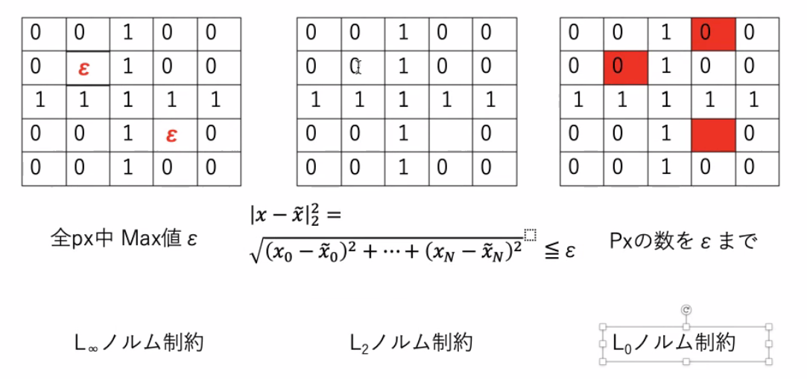

<!-- tex script for md -->

# 報告会 議事録 2021年05月17日

## 報告

### 片岡
- フィルターバブルは企業が手を付けにくい分野で面白そう
- 既存手法を調べる
- Web記事は査読が少ないので注意
- 国際会議　プロシーディングスの新鮮な論文を読む
    - 査読は少ない
- 研究会報告
- 小数派意見の提示の難しさ
   - zipfの法則
     - 頻度が高い単語の数 だいたい= 頻度が1の単語の数
     - 頻度と頻度の順位が反比例
     - 1件の意見（少数派意見）が山ほどある
   - 新しくないが、解決策が多いわけでもなく、良いかも
- アンケート
  - 研究室外での出費は要検討
  - クラウドは出費大
  - 高齢者にお願いする仕組みはあるらしい
- 記事かどうかは重要でない
- 推薦というより、最適化や影響力に重点
- アプローチを詰める
- 目的は良い
- 技術的な問題点がどこにあるかがない
  - 先行研究を見てみる
  - zipfの法則など
- 時間があればアンケートの自由記述を要約してみる
  - 手法

### 亀川
- オントロジー
- 信頼度の調整された敵対的訓練（CCAT）
    - 一様分布とワンホット分布を利用？
    - L2
        - カラー画像
        - 単位円
    - $L\inf$
        - $^p\sqrt{\sum_i|x_i|^p}$
        - 単位円に外接する正方形
- 敵対的にロバストなモデルが何を見ているか
    - 攻撃と分類はトレードオフ
    - 第1層の可視化
        - 波や市松模様
- テーマ
    - オントロジーをNNに組み込む

### 志田
- 車両検知
    - 夜がまだ厳しい
- 車のヘッドライトの対称性
    - 二輪車でやってみる？
    - 玉切れなどの例外
    - 対象になっていない可能性
    - 繁華街のネオンサインに弱い
    - 時間軸をどう扱うか
- まず簡単な昼間の手法を確認してみよう
    - 93.5%は実用に及ばない
        - なぜ？
        - これとどっちがやりやすい？
- 片岡アイディア
    - 赤外線
    - バックライトがない昼間の日陰
    - サーモグラフの熱源の形状
        - ボディで反射？
- 夜のデータセットがどれだけ少ないか

### 土屋
- 迷走回
- 画像の需要は少ない？
- 動画の方が多い？
    - 時間が足りるか不安
        - 今までのリサーチと繋がらない？
- 歌い出し
- 映像と音声から動物の行動認識
    - 音声は不正解な動体の区別に役立つ？
- オンライン会議の話者認識
    - i-vector（混合ガウスモデル）
- 技術的なうまみは？
- マルチモーダル性をより活用できるものは？
- 映っているものの行動・場面の認識に興味
    - 既存研究がどこまでできているか
- データセットがあるかも考慮して
- スケートの技の終始点の切り出し
- 音声の文字おこしは進んでいるので活用できるかも

### 平山
- ネットワークを正規化
    - タスクごとに重みを制限？
    - 忘却を保証できていない
- なぜ忘却が発生するのか
- よくわからないから手を付けない、は危険
    - それが最適解である可能性がある
    - 危険さを理解してから手を付けない、が良い
    - 時間と要相談

### 増岡
- 大きさや重みからML
- 苦味は難しい
- 葉から病気を診断
    - データセットがない
- 画像から鮮度を予測
- バナナのエチレン量とアルコール量
- レタスの表面色彩、元素計測、水分計測
    - 時間がかからない
- 定量化の仕組みをどうするか
    - 画像はエッジ抽出などのひと工夫がいることを覚悟

### 松本
- 本は著作権が厳しい
    - ニュースが良さげ
        - ただ、ライフサイクルが短い
            - 協調性フィルタリングは不適
- ニュースのタイトルにコンテキストを追加する
- 内容からタイトルを推薦
    - アメリカ -> 米
    - 既存のタイトルを教師として復元できているか
        - 類似度
- システムなしに評価は語れない
    - 設定した目的が達成しているかの評価

### モ
- Video2Vec
    - ベクトル化できる音楽動画に絞る？
        - 音はまだしも音楽は理解してないとキツいよ

### 原田
- SVR（サポートベクタ回帰）
    - NNと異なってブラックボックス化しない？
    - 線形カーネル
        - カーネルを使っていない
    - 先生「なぜSVR？NNでよいのでは」

## 気になったこと
- マルチモーダルって結局なんだ

## 業務連絡
- テーマ発表会の日取りをぼちぼち決める
