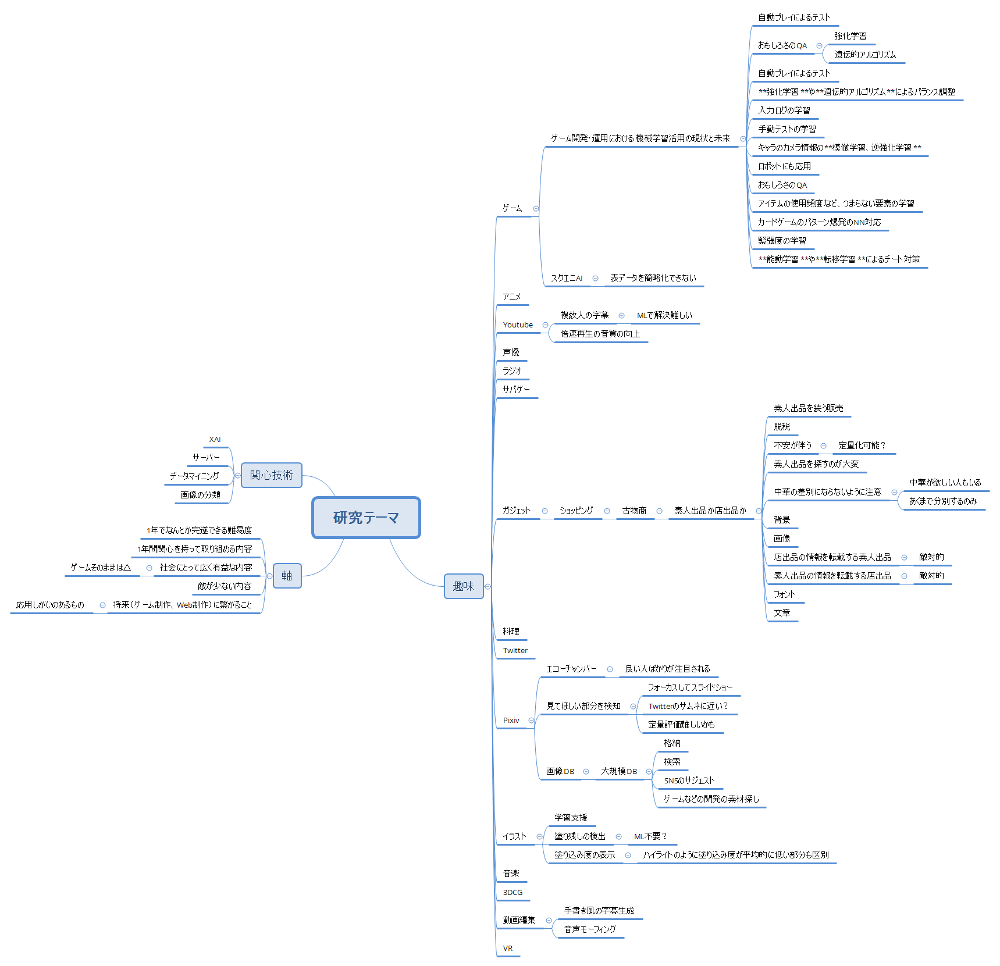

<!-- tex script for md -->

# 週次報告書 2021年05月10日
AL18036 片岡 凪

## 今回の報告会までに実施する予定だったこと
- 関心分野
    - データマイニング
    - ~~DB~~ SQL＋ML
    - サーバー＋ML
    - 逆強化学習（未着手）
    - 転移学習（未着手）
    - [説明可能な AI (XAI)](https://www.jstage.jst.go.jp/article/jsimconf/80/0/80_51/_article/-char/ja/)（未着手）
- テーマを考える
    - 前回のサジェストの質向上など
<!-- - Youtubeの暴言、指示
    - 動的な教師
        - 半教師？
    - そもそもMLいる？ -->
- hand's on ML
    - スライド作成（未完）

## 実施内容

### PCの組立て
放置していたPCパーツを組み上げ、最低限の環境構築を行い、研究環境が多少快適になった。

### スライド添削
2度の**相談会**にて、疋田先輩に片岡、土屋、原田、松本の勉強会スライドを添削していただいた。ページの冒頭にページの要約を提示することや、脳の消費リソースを極限まで減らす工夫などが印象に残った。非常に有益な内容であり、**今後も定期的にメンバーで共有していきたい**と感じた。学んだことが今週の勉強会で活かせるよう、資料作成に多くの時間を割けるようにしたい。

### 研究テーマのマインドマップ
研究テーマを決めるため、趣味と関心技術を基にマインドマップを作成した。自分の関心を網羅的に整理することができ、また以下の新しいアイディアも生まれた。  
- 動画の倍速再生の音質向上
- **ネットフリマの画像からショップ販売か素人販売かを検知**
- **画像の大規模検索**
- イラストの塗り込み度を可視化して学習・業務支援

マインドマップは今後も更新していく予定である。  
  

<!-- ### ゲームのML（成果なし）
ゲーム以外に利用できそうなMLを探すため、ゲームのMLに関する記事を3つ読んだが、大きな成果はなかった。DQNがQ学習由来である -->

### データマイニングの調査は保留
データと目的があってはじめて始まる研究分野であり、その目的がマインドマップで挙がらなかったため、調査は保留することとした。

### サーバーはリソースやモチベが△
関心のあるサーバーと機械学習を組み合わせたとき、どのような社会貢献が可能であるかの想像がつかなかったため、この2単語で検索して何かしら関心の強い応用技術がないかを調査した。  
  
Google scholorで「server machine learning」と雑に検索をかけたところ、**DDNN**（分散DNN）を扱いやすくする**パラメーターサーバー**という技術や、異常検知などの**セキュリティ技術**が多く見受けられた。**前者は大規模データや計算資源を用意できるかに若干の不安を感じ、後者は研究したいと思うほどのモチベーションを感じなかった。**  
  
調査の副産物として、**志田くん**が関心を持ちそうな論文を見かけたので記録しておく。**分散セキュア量子機械学習（DSQML）**という、量子技術を持たない古典的なクライアントが、プライバシーデータを保持したまま遠隔地の量子サーバに量子機械学習を委ねることを可能にする技術に関する論文である。  
[Sheng, Yu-Bo, and Lan Zhou. "Distributed secure quantum machine learning." Science Bulletin 62.14 (2017): 1025-1029.](https://www.sciencedirect.com/science/article/pii/S2095927317303250)

### SQLとMLは価値提案が難しそう
「サーバーとML」と同様なモチベーションで「SQLとML」について調査したところ、以下のような技術が見受けられた。
<!-- SQLについては関心はあるが知識が多いわけではなく、MLのみを用いたXAIなどの路線で言った方がより有益なアイディアを生みやすいのではないかと考えた。 -->

- 特定のDBに特化したMLフレームワーク / SQLの改良
- DBMSのノブ？のチューニング
- ML用コードの生成
- In-DB ML（DB内でMLを行い、データ抽出を省いて高速化）
- SQLインジェクション攻撃の検知・防御
- 隠れマルコフモデルのSQL文への変換

SQLを用いた研究は、何を実現するかではなく、SQLという手段に焦点を当てた研究が多いように感じ、**SQLを用いた業務に長けていない場合はより有益なアイディアの発想が難しいように思えた**。

### 大規模画像検索
容量や特徴の多い画像を表示するDBの格納形式や検索システムに興味があったため、調査し、新しい価値提案ができないかを考えた。  
  
まず、**画像を入力とする画像の検索システム**に関する論文をいくらか調べ、古いがより一般的な内容を記していそうな論文を選択し、目を通した。

次に、**大規模な画像を扱う上でサーバーの負荷を軽減する手段**がないかに関心を持ち、それに関する論文を選択して目を通した。

応用先としては、SNSでのサジェスト機能や、多くの画像素材を扱うゲームなどの開発現場での容易な素材の検索などが挙げられる。
面白く難しすぎず、アイディアも出しやすそうな題材に感じた。アイディア出しは未着手。
<!-- ネオン看板の自動生成 -->

### エコチャンバー
良い作品ばかりが検索にかかってしまう問題は「エコチャンバー」と呼ばれていることが判明。検索が容易になった。  

## 次回までに実施予定であること
- hand's on ML
    - スライド作成
- エコチャンバーの概要の調査
- ネットフリマのアイディアに既存手法がないか
- （大規模画像検索の応用）
- （逆強化学習の応用）
