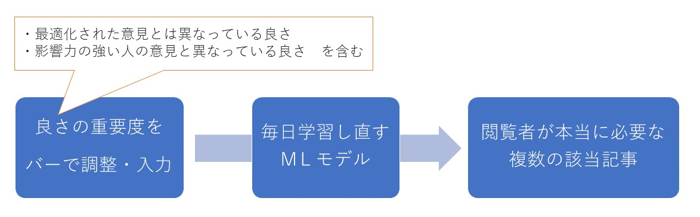
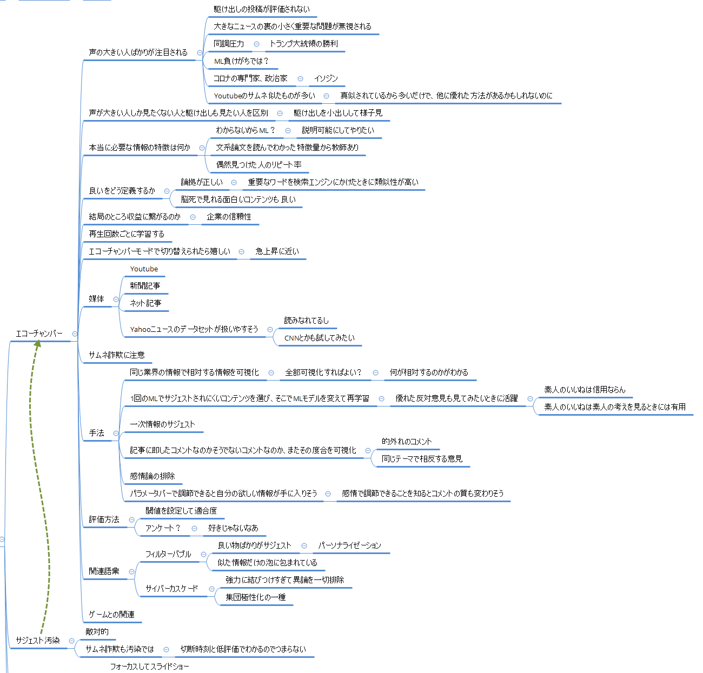

<!-- tex script for md -->

# 週次報告書 2021年05月17日
AL18036 片岡 凪

## 1. 今回の報告会までに実施する予定だったこと
- テーマを絞る
    - エコーチェンバー現象の概要の調査
        - アイディアが広がったので、抜けが無ければこれでいく予定
    - ~~ネットフリマのアイディアに既存手法がないか~~
        - ボツ（画像認識以外の情報を使えばよい）
    - ~~（大規模画像検索の応用）~~
    - ~~（逆強化学習の応用）~~

## 2. 実施内容

### 目次
1. エコーチェンバー現象の概要のWeb調査
2. エコーチェンバー現象の関連語彙の調査
3. フィルターバブル・エコーチェンバー現象で何の研究ができそうか 
4. おまけ：エコーチェンバー現象のブレインストーミング

### 2.1 エコーチェンバー現象の概要のWeb調査
先月から報告会で提案している「エコーチェンバー現象」について、研究テーマにできるような切り口を探すために調査を行った。エコーチェンバー現象の語義は以下の通りである。  
  
> 《echo chamberは反響室の意》SNSにおいて、**価値観の似た者同士で交流し、共感し合う**ことにより、**特定の意見や思想が増幅されて影響力をもつ現象**。攻撃的な意見や誤情報などが広まる一因ともみられている。  
> デジタル大辞泉「エコーチェンバー現象」
  
>   
NHK(2018)「NHK クローズアップ現代＋『「なぜ起きた？弁護士への大量懲戒請求」』／番組内でも取り上げられた「エコーチェンバー現象」や「フィルターバブル」は本当にネットの実態にあっているの？」より

**具体的な問題**として、**選挙の時期に選挙に関係のない時事問題がTwitter上で注目して議論されていなかった**ことや、2016年のアメリカ大統領選挙で勝利した**トランプ大統領が、SNSで支持者を囲い込んで反対意見を見えにくくした**ことなどが挙げられる。
> - [Barberá, P. et al. (2015) ‘Tweeting From Left to Right: Is Online Political Communication More Than an Echo Chamber?’, Psychological Science, 26(10), pp. 1531–1542. doi: 10.1177/0956797615594620.](https://journals.sagepub.com/doi/abs/10.1177/0956797615594620)  
> - [IDEAS FOR GOOD「エコーチェンバー現象とは・意味」](https://ideasforgood.jp/glossary/echo-chamber/)
  
エコーチェンバー現象は**政治との相性が強い**との記載が多く、また実際にそのような論文ばかりであった。日本に置き換えると、**自身の考えを放棄して影響力の強い特定の感染症専門家に頼りきってしまうような政治**や、**そのような政治家の言動に影響されて国民が特定の商品を買い占めるような状況**はエコーチェンバー現象に該当していると考える。専門家によっては科学的根拠の乏しい議論を行う人もいるため、多くの専門家から得た広い見解から行動すべきだと考える。

> - [Yahooニュース（2021年5月14日）「緊急事態へ、10分で方針変えた官邸　**首相「専門家の結論なんだろ」**」](https://news.yahoo.co.jp/articles/2028e4adeac3e6a44df4fa91e2a70abcdb81b1eb)
> - [しんぶん赤旗 (2020年8月)「吉村・大阪府知事の**うがい薬発言**に批判　医師会会長「**科学的根拠が不足**」](https://www.jcp.or.jp/akahata/aik20/2020-08-11/2020081101_04_1.html)
> - Abema TV, 宮沢孝幸（2020）[【新型コロナ】「**緊急事態やGoTo除外はすべきではない**」第3波襲来でも経済は止めるべきじゃない？ウイルス学 宮沢孝幸准教授が苦言【新しい生活様式】｜#アベプラ《アベマで放送中》](https://www.youtube.com/watch?v=VwmwEvOVtxc)

### 2.2 エコーチェンバー現象の関連語彙の調査
エコーチェンバー現象の関連語彙として、**フィルターバブル、サイバーカスケード、集団極性化**がある。これらの語義は、論文を検索する上で重要となる。  
  
フィルターバブルは、**ユーザに最適化されたコンテンツばかりがサジェストされる**、情報の泡に包まれてその他の情報が見えにくくなってしまう状態を指す。以前の報告会で紹介したYoutubeのサジェストの話は、エコーチェンバー現象よりもこの語彙の方が近い。  
  
サイバーカスケードは、**インターネット上の意見交換で、ある事柄への賛否いずれかの論が急激に多数を占め、先鋭化する傾向をもつこと**を指す。 インターネットに限らないケースでのこの傾向は、集団極性化と呼ばれる。
  
<!-- サジェスト汚染は、 -->

> - [IDEAS FOR GOOD「エコーチェンバー現象とは・意味」](https://ideasforgood.jp/glossary/echo-chamber/)
> - [IDEAS FOR GOOD「フィルターバブルとは・意味」](https://ideasforgood.jp/glossary/filterbubble/)
> - [IDEAS FOR GOOD「サイバーカスケードとは・意味」](https://ideasforgood.jp/glossary/cyber-cascade/)
> - [比較biz（2021）「サジェスト汚染とは？発生する原因・放置が危険な理由・対策方法を解説」](https://www.biz.ne.jp/matome/2004453/)
> - デジタル大辞泉「フィルターバブル」
> - デジタル大辞泉「サイバーカスケード」
> - [心理学用語集（2019）「集団極性化」](https://psychoterm.jp/basic/society/group-polarization)

### 2.3 フィルターバブル・エコーチェンバー現象で何の研究ができそうか
これらの問題を解決するために、閲覧した情報媒体において、**最適化された意見とは異なっている良い情報をサジェストする機能**や、**影響力の強い人の意見と異なっている良い意見をサジェストする機能**が必要であると考えた。  
  
このとき、**良いコンテンツとは何か**を考える必要がある。論拠が正しい情報が良いのか、共感や反感を持って面白いと感じられる情報が良いのか、「いいね」や閲覧数が多ければ良いのか、これは閲覧者の嗜好や状況（趣味・仕事・学術研究など）によって様々である。そこで、**閲覧者に依存する複数の「良さ」の条件のそれぞれについて、重要度を調節してサジェストするように設定できるシステム**を提案する。またこの「良さ」には、「最適化された意見とは異なっている良さ」や「影響力の強い人の意見と異なっている良さ」も含める。  
  
**日々更新される情報媒体**を扱うことを考えると、**転移可能な学習モデル**である必要があると考える。

↑ 提案手法の概要

 
  
「最適化された意見とは異なっている良さ」を出力に反映するためには、まず**ユーザへの最適化について知る必要がある**。最適化には、サイトの閲覧履歴（Cookieなど）や購買情報、住所などの個人情報を利用していると推測する。これらを**行う/行わないの2値の調節**が最低限できればよいが、可能であれば**連続的な重要度の調節**ができれば好ましい。もしくは、最適化を行ってサジェストされた記事を除外し、再び学習モデルに通すことを考えてもよい。
  
「影響力の強い人の意見と異なっている良さ」を出力に反映するためには、影響力の強い人の**文章の思想の癖を正確に学習**し、その類似度の低い記事をサジェストする学習モデルを構築すればよい。関連記事のサジェストではなく、記事へのコメントのサジェストを考えると実装が容易になりそうである。普段閲覧しているYahooニュースが[大規模データセット](https://xtech.nikkei.com/it/atcl/news/16/011500114/)を公開している。
  
いずれの「良さ」も、**否定語を含めることで逆の意見に変容してしまうことに注意したい。** この注意点は、自然言語処理の講義で学んだ内容からアプローチしたいと考えている。

また、意見は異なれど、記事のジャンルは統一したものをサジェストできるようにしなければならない。これは、記事のジャンルごとに学習を行えば問題ないと考えるが、可能であれば記事のジャンルを超えた柔軟なサジェストができると好ましい。

副産物として、記事への感情的なコメントを重要視するか否かを設定できるようになると、コメントをする一部の人々は感情的なコメントを控えるようになる可能性がある。これが良いか悪いかは詳しく調査する必要がある。（そもそも実装するか怪しい）

提案手法を**評価**するにあたって、**それぞれの良さにおいて入出力が適当であるか**と、**この手法によるシステムをユーザが必要としているか**を精査しなければならない。双方とも定性評価を介すため、客観的なデータを得るために**アンケート**による実験を行い、**統計**によって評価を行うべきだと考える。

### 2.4 おまけ：エコーチェンバー現象のブレインストーミング

## 3. 次回までに実施予定であること
- ユーザへの最適化の方法について知る
- 「最適化された意見とは異なっている良さ」の実装方法を詰める
- 「影響力の強い人の意見と異っている良さ」の実装方法を詰める
- 様々なメディア媒体で、研究テーマに類似した機能がないかを調査
- 使用可能なデータセットの詳細を詰める
- 先行研究の調査
    - フィルターバブル・エコーチェンバー現象をMLを用いて解決する論文
    - 具体的なモデルに関する論文
- （フィルターバブル・エコーチェンバー現象の具体的な問題を紹介する文系論文）
