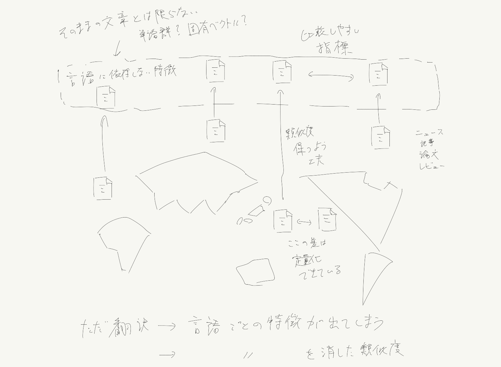
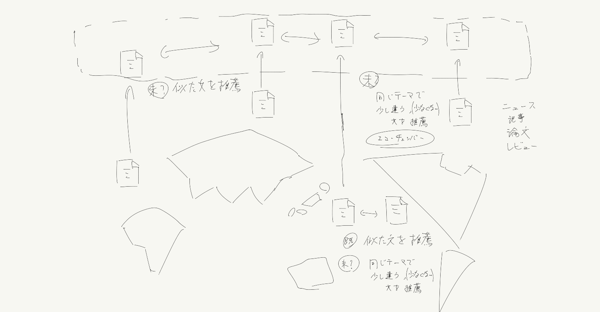

<!-- tex script for md -->

# 週次報告書 2021年06月21日
AL18036 片岡 凪

## 1. 今回の報告会までに実施する予定だったこと
- 技術的問題点を考える

## 2. 実施内容

### 目次
- 2.1 先回までの指摘点の整理
- 2.2 多様性の指標の調査（迷走）
- 2.3 社会的問題点の整理
- 2.4 技術的問題点の思案
- 2.6 提案手法まとめ

### 2.1 先回までの指摘点の整理
先回は「**出稿後の記事の多様性の確認ツール**」を提案したが、**技術的問題点が不足**していた。
解決手法を邪魔している問題などを見つけ、それを取り除く手法と結果を仮定する必要がある。

その他、**記事に限定せずに広い視野で見る**こと、**限定的なツールでなく分析手法**を思案すること、**全特徴量を用いた絶対評価ではなく、特徴量を絞って相対評価も考慮すべき**であること、**5W1Hを考える**ことなどをご指摘いただいた。

また、「研究で求められること」を見返すと、技術的問題点（意義）の分類としては、「既存手法の精度や時間といった問題」や、「自力で発見した完全に新しい問題（難しい）」が挙げられる。新しい問題の解決手法を提案することも視野に入れて考えたい。

### 2.2 多様性の指標の調査（迷走）
技術的問題点を考えるにあたり、「記事の多様性の指標」に関する論文の概要を読み漁った。

情報の中立度を算出する論文を読んだが、ユーザの行動ありきの分析手法であり、**記事の文章そのものを分析する**本手法には適用できないことに後々気が付いた。
[1]敏弘神嶌, 昭太郎赤穂, 英樹麻生と淳佐久間, 「情報中立推薦システム」, 人工知能学会全国大会論文集, vol. JSAI2012, p. 3E1R61-3E1R61, 2012, doi: 10.11517/pjsai.JSAI2012.0_3E1R61.

「推薦で分類をする以上、絶対的に客観・中立な選択は存在せず、ある限定された特徴量の中で中立性を考える必要がある」という意見は参考になった。

### 2.3 社会的問題点の整理
分析対象について混乱したため、社会的問題点を図示して整理した。

別々の国の文章の内容を比較したいわけだが、図のように、**全ての文章を、比較しやすい何らかの特徴に置き換える**必要がある。
ここで、**何を特徴にするのか**と、**その特徴を用いてどう比較するか**が重要となってくる。

### 2.4 技術的問題点の思案
軽く概要を漁ったところ、BERTや独立話題分析、文書単語類似度行列の固有ベクトルなど、**同一言語の**文章内容の類似度を定量化する手法は様々見受けられた。

より調査が必要だが、**異なる言語**を介した類似度の算出は見受けられなかった。
従って、先述のような文章内容の類似度の定量化手法が「別言語間で対応していないこと」を技術的問題点とし、それを解決する手法を提案できそうだと考えている。

この提案手法で構築できるシステムを挙げるとすれば、「選手AのB大会のC賞」に関する日本の記事を入力し、「選手AのB大会のC賞」に関するアメリカの記事を推薦するシステムをつくることができる。（もう少し論文を読めば他の用途もありそうである）
この手法を拡張して、「選手AのB大会のC賞」に関する日本の記事を入力し、日本では報道されていない「選手DのB大会のE賞」や「選手Aの最近の怪我」に関する記事などを推薦するシステムができるとなお良さそうである（竹島問題の話と同様）。

固有ベクトルを用いた場合、複数あるベクトルのうちある1つ以上のベクトルを動かして他の類似度に一致させることができれば、このシステムの実装が可能であると考える。日本国内の2つの記事でこれを実装している研究がないか調査するべきだと考えている。

### 2.5 提案手法まとめ
社会的問題を「**エコーチェンバー**」、技術的問題点を「**文章の類似度定量化手法の異言語間の未対応**」とし、「**（固有ベクトルなど。要調査）を用いた異言語間の文章類似度の定量化手法の提案**」とする。

## 3. 次回までに実施予定であること
- 月
    - 報告会の振り返り
    - 週のTODO決め、リスケジュール
- 火
    - 目的の調査
        - 新規性に注意
    - 手法の調査
- 水
    - 手法の調査
- 木
    - 手法の調査
    - 概要書作成
- 金
    - 目的・手法の相談
    - 相談の振り返り
    - 概要書作成・提出
- 土
    - 相談の指摘点の調査
- 日
    - 報告会の資料作成
    - 予備実験の検討

## 雑多メモ
- アイディア
    - GANの多様性維持技術はフィルターバブルに応用できないか
    - エコーチェンバーか認知論的バブルかの判別
        - 裏に操作があるかどうか
            - 倫理問題あり
            - データがない
                - 簡単な対象で試し、より大きな組織（案に国を示す）に適用できることを諭す？
    - 相手の意見を聞く必要がある文面かどうかを分析する問題
        - 対のトピックがあるかどうか
        - その数
        - SNSから学習？
    - ～を用いた翻訳にロバストな情報中立指標
    - 文章要約に近いのか
- 内容の類似度
    - 独立話題分析
    - 時系列データに対応すれば、書きかけでも分析可能？
        - https://ci.nii.ac.jp/naid/130007658694
    - BERT
- 特徴量抽出前の文章の内容指標を教師データとし、抽出後の文章の内容指標が教師データに近くなるようにすると面白そう
- イメージ共有の齟齬の起こりやすい抽象度の解析
