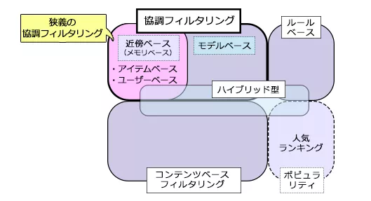
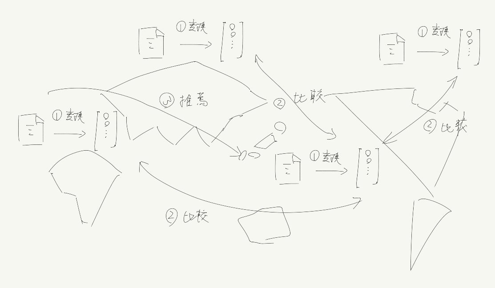

<!-- tex script for md -->

# 週次報告書 2021年06月28日
AL18036 片岡 凪

## 1. 今回の報告会までに実施する予定だったこと
- 報告会の振り返り
- 手法の調査 △
- 概要書作成 △
- ~~予備実験の検討~~

## 2. 実施内容

### 2.1 推薦システムの概要の調査
異言語の推薦手法を考える前に、同じ言語での推薦手法を調査し、基礎の確認に努めた。2018年にニュース推薦に特化したレビュー論文を見つけ、これに目を通している。

[1]M. Karimi, D. JannachとM. Jugovac, 「News recommender systems – Survey and roads ahead」, Information Processing & Management, vol. 54, no. 6, pp. 1203–1227, 11月 2018, doi: 10.1016/j.ipm.2018.04.008.

本稿の推薦システムは、以前Discordで共有した下図のうち、協調フィルタリング、コンテンツベース、知識ベース

### 2.2 Word2Vecの調査
モ君と話しつつ、word2vecの特徴量（各基底ベクトルの特徴？）がどのように選択されるかを軽く調査した。共起語の頻度を設定するように書かれた記事が見受けられたが、学習のブラックボックスな過程で選択される、人間に理解できない数値であるという見解に落ち着いた。

### 2.3 概要書の着手
概要書のテンプレートや「研究で求められること」に目を通し、概要書の書かれ方をWebで調査した。Webにはまともな記事がなかったため、多くの論文の形式に寄せて、はじめに（背景）、先行研究、提案手法、実験方法、まとめ、参考文献の順で書こうと考えている。

図が1枚必要なため、考えの整理もかねて提案手法の概要の作図を再度行った。提案手法は内容が比較的複雑でないため、作成した図の代わりに、先行研究の技術のキモ、もしくは結果の数値表を用いることも検討している。

図は来週整形する予定だが、倫理と著作権にどの程度気を使うべきかに疑問を感じた。世界地図で推薦を示す場合、グリーンランドといった端の国を省略してよいべきか、推薦システムに選ばれた地域を贔屓目に見ているように捉えられることがないかに留意する必要がありそうである。また、論文に使用可能だと謳うフリー素材を愚直に使用・加工してよいか、規約があやしいpptの代わりにどのようなソフトを使うべきかが気になった。

また、配布されたtexのテンプレートをコンパイルしたが、初めて用いたbibtexのmakeが上手く動作しなかった。具体的には、本文のコンパイルは上手くいき、pdfは生成されたが、参考文献より下が何も出力されなかった。概要書の仮組の提出後、エラーコードを読んで詳しく調査する予定である。

### 2.4 同期にお願い
月水金土日の14時以降にDiscordに籠るので、見かけたら参加してくれると嬉しいです。

## 3. 次回までに実施予定であること
- 月
    - 概要書の作成
- 火-金
    - 推薦システムの残りを読む
    - 同じニュースサイトのプロの翻訳者の翻訳とDeepLの翻訳との違いを見る
    - 言語の特徴の語学的な要因を見る
    - 日本と海外のニュースの書かれ方の違いを見る
    - 手法の調査
    - 概要書の修正
    - bibtexの修正
    - 一致する研究がないか
- 土
    - 本文の着手？
- 日
    - 題目を詰める

## 雑多メモ
- 単純翻訳と何が劣るのか
- スペース位置が特殊な言語を比較したい
    - hands-on-ml 16.2
        - 日本語、中国語、ベトナム、ドイツ、英語
- Google scholorで英日両方出ると嬉しいよね
    - 検索語を共通の特徴量に変更
- 違う言語では協調検索は通用しない
- NLPのセマンティックウェブは使えるかも
