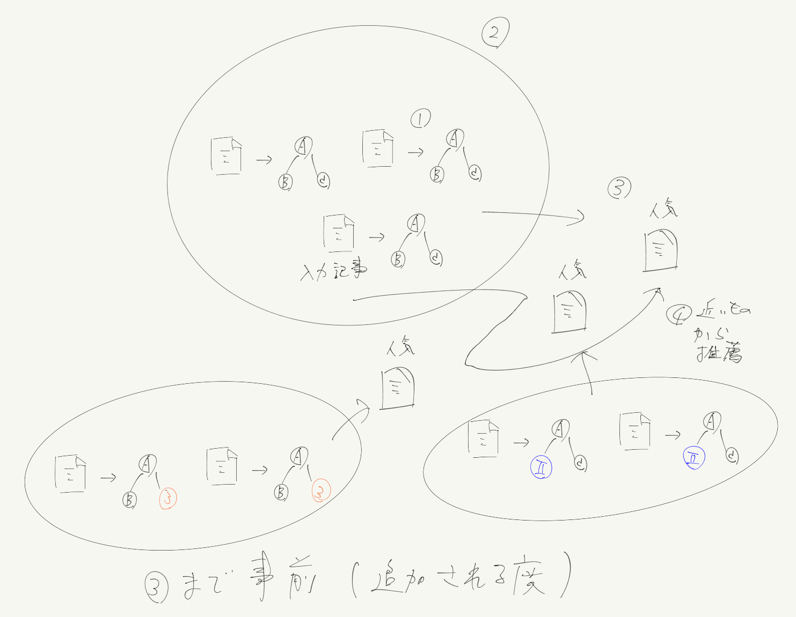

<!-- tex script for md -->

# 週次報告書 2021年07月05日
AL18036 片岡 凪

## 1. 今回の報告会までに実施する予定だったこと
- 月
    - 概要書の作成
- 火-水
    - 推薦するモノの考案
- 木-日
    - レビュー論文の続き
    - 何を推薦し、何を推薦しないかを考案
    - ~~簡単な推薦システムの構築~~
        - モデル
        - 指標
    - 題目候補の考案

## 2. 実施内容

### 2.0 目次
- 2.1 推薦システムのレビュー論文を読了
- 2.2 推薦するモノの考案
    - 2.2.1 （skip）国境なき記者団の「報道の自由度」を調査
    - 2.2.2 クロスリンガルの推薦手法の調査
    - 2.2.3 目的から推薦するモノを考案
- 2.3 手法の考案
- 2.4 題目候補の考案

### 2.1 推薦システムのレビュー論文を読了
推薦システムの基礎学習として、前回読み途中であったレビュー論文を読み終えた。

**推薦システムの達成目標**として、分類精度、ランキング精度、多様性、新規性、セレンディピティ、拡張性、再学習の速度、スパース性（わずかな本質データの見極め）などが述べられていた。

また、DBPediaといった**データセット**やオントロジーのような**データ形式**、評価を容易にするIDOMAAR、STREAMINGRECといった**フレームワーク**について知ることができた。

M. Karimi, D. JannachとM. Jugovac, 「News recommender systems – Survey and roads ahead」, Information Processing & Management, vol. 54, no. 6, pp. 1203–1227, 11月 2018, doi: 10.1016/j.ipm.2018.04.008.

### 2.2 推薦するモノの考案
先回の報告会では、推薦するモノとして「大阪の大会の記事を入力し、錦織の大会でなく、大阪の怪我の記事が欲しい」といった例が挙げられた。

このようなWhat, Howの例を考える。

#### 2.2.1 （skip）国境なき記者団の「報道の自由度」を調査
友人が共有した「報道の自由度」に関する記事を読んだ。

日本は記者クラブによる自由度の低下を指摘され、報道の自由度は67位に位置づけられていた。その他の国の過激な報道規制の例は何かの参考になりそうだが、研究倫理が怪しいので思案は保留とする。

報道の自由度の評価指標は、多元主義、メディアの独立性、環境と自己検閲、法律上の枠組み、透明性、インフラストラクチャー、虐待に基づいていた。説明が曖昧な定性データと定量データが混在しており、参考にならなかった。最終的な評価は、上記項目の単純な重みづけ線形和であり、重みづけの方法の説明は記載されていなかった。

[1]「Japan : Tradition and business interests | Reporters without borders」, RSF. https://rsf.org/en/japan (参照 7月 04, 2021).
[2]「2021 World Press Freedom Index: Journalism, the vaccine against disinformation, blocked in more than 130 countries」, RSF, 4月 19, 2021. https://rsf.org/en/2021-world-press-freedom-index-journalism-vaccine-against-disinformation-blocked-more-130-countries (参照 7月 04, 2021).

#### 2.2.2 クロスリンガルの推薦手法の調査
多言語のニュース推薦を調査したところ、**クロスリンガル**というキーワードで多くの論文がヒットすることが判明した。推薦するモノの参考のため、いくつかの論文の概要を参照した。

クロスリンガルのニュース推薦には、オントロジーマッチング、クロストレーニング技術、WikipediaとBabelNetの知識、検索候補の多言語化、クロスモーダルなセマンティックアノテーション、単語埋め込みによるトピック生成、「多言語の記事から**何が起きたのか、誰が関係しているのか、どこで、いつ起きたのか**を検出」といった手法が提案されていた。

中でも、任意の言語の記事を概念の関係に写す**オントロジーマッチング**は、クロスリンガル推薦に適していると考えた。ただし、ここでは概念関係の類似度の算出しかしておらず、これを基にしたクラスタリング等は行っていないようであった。

#### 2.2.3 社会的問題から推薦するモノを考案
6月21日の報告会議事録より**社会的問題**を抜粋する。

> 国内外のエコーチェンバー現象で具体的にどのようなことが落とし穴になるのかを考えた。エコーチェンバーが国レベルで発生するのは、**日本国内のほとんどのニュースサイトで同じ内容の記事が書かれているにも関わらず、日本以外の多くの国で日本とは異なる内容が書かれていた場合**であると考える。

日本とあるが、国境は考えずに世界の任意の記事を入出力とする。
この問題は、多言語の推薦に対応することである程度緩和される。

この問題に近しい、局所的な地域の局所的な規制が要因となる「報道の自由度」の問題の解決のため、推薦するモノを**世界でよく執筆されているトピック群のそれぞれの代表記事**とすればよいと考えた。
世界でよく執筆されていれば、局所的な規制を受けにくいと考える。
また、ここでいう**トピック**には、記事の**内容をよく表す5W1H**の情報や、**多言語に対応しやすいオントロジー**が利用できると考えた。人気度は閲覧数などに

### 2.3 手法の考案
下図のような手法を検討している。
事前にデータ内の全ての記事のオントロジーを構築し、オントロジーに基づいて記事をクラスタリングし、クラスタ内の代表となる記事（まだ曖昧）を選定しておく。
その後、ユーザが記事を閲覧したとき、そのオントロジーが属するクラスタに近いクラスタの代表記事を複数推薦する。

また、以上のシステムは頻繁に追加される新規アイテムに耐えうるものである必要がある。

技術的な新規性は、トピック抽出とオントロジーの組み合わせ方や、適切なクラスタリング手法の検討にある。

### 2.4 題目候補の考案
以上をまとめ、以下の題目を提案する。
- **オントロジーと主要トピックに基づく多言語ニュース推薦手法の提案**
    - 主要：複数のトピックの存在を示す
- **記事トピックのクラスタを用いた多言語ニュース推薦手法の提案**
- **執筆の多いトピックに基づく多言語ニュース推薦手法の提案**
    - What特化
- エコーチェンバー、報道の自由度は解決できる1問題に過ぎない？

予備案として、エコーチェンバーが発生しやすい感情を含む概念をオントロジーから除く手法も考えている。
また、オントロジーの論文を読んだ後に新たな問題が見つかる可能性も考えている。

## 3. 次回までに実施予定であること
- 月-水
    - 概要書作成
- 木
    - [ニュースオントロジー](https://ieeexplore.ieee.org/abstract/document/7890880)の追試
- 金土
    - トピック抽出手法の調査
    - クラスタリング手法の調査
- 日
    - スライド作成
    - 報告会準備

## 雑多メモ
- **ユーザが入力した記事に関連しないトピックには弱い**
- 推薦する記事
    - 肝
        - わざわざ世界
            - 世界でよく議論されるトピックの組・関係のクラスタ
                - トピック＝記事を代表する5W1Hに関わる語彙
                    - 論文によって諸説あり
                - 議論される＝トピックの類似度が近い記事が多い
            - 知らないクラスタを発見してほしい
            - 最適を表示するのでなく、信用できる複数を提示
            - クラスタの代表は
                - 最終的に人気度（閲覧数）で決める論文も
                - トピックの組・関係の類似度
        - 言語
            - 誤訳をどう改善するか
                - ニュース推薦の視点で
        - 文化
        - エコーしないこと
            - エコーしやすい記事は？
                - 感情で新規性を感じさせる
                - 世界のそれぞれに極性辞書を割り当てるのは大変
            - 著者のマップ
            - 井の中の蛙の外
                - 井の中
                    - 
                - 井の外
        - スパース性
            - 本当に大事なひと握りの記事
            - 人気だけど世界の多くで議論されていない？
        - オントロジーは更新に強いのか
            - というよりその後のクラスタリング？
    - 倫理がセーフな具体例
    - 題目
        - 
    - 報道の自由度
        - 入力：キーワード
        - 出力：
    - 希少な観点（セレンディピティ？）
        - 引用元のネットワーク
        - 入力：記事
        - 出力：
    - wikipedia等からトピックのバックグラウンドに関連する情報
        - 手法から攻めるな
        - 世界でやる必要がない？
            - 助詞の除去など
            - 助詞は前もって設定すればよいのでは
        - 同じ言語なら検索しやすそう
        - タイトルの全単語を調べる
        - wikiが長い、などから単語の重要度がわかる？
        - 記事の内容とwikipediaの内容で一致する単語
        - ニュースの分野でやっている人は少ないのでは
    - 珍しいトピックだが信憑性の高い情報
    - 多様性の論文の概要
        - 同じストーリー、人物、イベントを薦めない単調にならない記事
        - ジャンルの網羅性（カバレッジ）と冗長性
        - 友人や専門家の模倣
    - 立教のトピック語推薦
    - 多言語の先行研究
        - クロスリンガル
        - [ニュースオントロジーの構築](https://ieeexplore.ieee.org/abstract/document/7890880)
            - タイトルと本文を別々に考慮
            - **オントロジーマッチング**
                - やりたいのはマッチじゃない
        - クロストレーニング技術
        - WikipediaとBabelNetの知識から概念
        - 検索候補の多言語化
        - クロスモーダルなセマンティックアノテーション
        - 単語埋め込みによるトピック生成
        - 多言語の記事から何が起きたのか、誰が関係しているのか、どこで、いつ起きたのかを検出
    - 報道の自由
        - 倫理が怪しい
        - RSF
            - 多元主義
                - メディア意見の反映度合い
            - メディアの独立性
                - メディアが、政治、政府、企業、宗教の権力や影響力の源泉から独立して機能できる度合い
            - 環境と自己検閲
                - 情報提供者が活動する環境
            - 法律上の枠組み
                - 情報活動を規制する法的枠組みの影響
            - 透明性
                - 情報の制作に影響を与える制度や手続きの透明性
            - インフラストラクチャー
                - 情報の制作を支えるインフラの質
            - Abuses
                - 虐待と暴力のレベル
            - 各指標には0～100のスコア