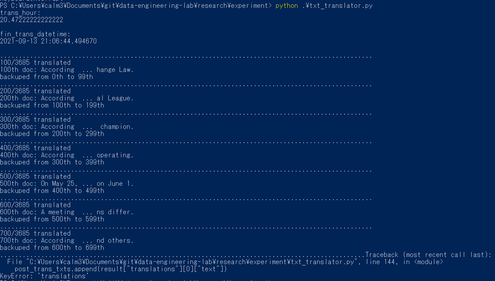

<!-- tex script for md -->
<script type="text/javascript" async src="https://cdnjs.cloudflare.com/ajax/libs/mathjax/2.7.7/MathJax.js?config=TeX-MML-AM_CHTML">
</script>
<script type="text/x-mathjax-config">
 MathJax.Hub.Config({
 tex2jax: {
 inlineMath: [['$', '$'] ],
 displayMath: [ ['$$','$$'], ["\\[","\\]"] ]
 }
 });
</script>

# 週次報告書 2021年09月14日
AL18036 片岡 凪

## 1. 今回の報告会までに実施する予定だったこと
- 予備実験
    - 既存プログラムのモジュール化
        - 記事のtxt化の修正
        - 英訳
        - ~~EvidenceとClaimの分類~~
    - 学習したモデルをGoogleドライブに格納できるか確認
    <!-- - クラスタリングの実装 -->
- 思考実験
    - 報告会の振り返り
        - （主張と出来事のクラスタリングの順序の是非）
        - ~~分類とクラスタリングの仮説の設定~~
- ~~研究スケジュールの修正~~

## 2. 実施内容

### 2.1 記事のtxt化の修正
以前実装できていなかったダブルクォーテーションの除去を実装した。
pythonの**文字列変数にimmutable(更新不可)の性質**があり、以下のような代入の挙動が理解できていなかったためにエラーが生じており、修正が完了した。
```
txt = txt[1:-1]
```

以下のように新たな文字列変数を作成して代入して対処した。
```
new_txt = txt[1:-1]
```

### 2.2 英訳
まず、DeepL APIの公式ドキュメントの全てに目を通した。本研究では以下の6点に注意が必要だと考えた。
1. utf-8の文書にのみ対応
2. **50万文字/月**
3. 最大50テキスト/回
4. GETよりPOSTを推奨
5. 内部で文を分割して翻訳
6. **長すぎる文章には対応できない**

項目2の「50万文字/月」では、japanese fakenews datasetの記事3685件のうち**700件しか翻訳できなかった**。
700件で足りるかを検討したとき、そもそもこのdatasetにはwikinewsしか含まれておらず、**似た出来事をクラスタリングできるかを評価する本研究では媒体の種類が足りていない**ことに気が付いた。
今後、同時期の複数のデータセットが提供されていないかを調査する予定である。

記事が何件必要かという議論は、出稿された時期の出来事の網羅性が高いかによる。
網羅性のためには、**時期を絞ってでも特定媒体の全ての記事を使用したい**。
そのため、今後の調査で見つけた**記事の件数だけ翻訳が可能な翻訳機**を調査する必要があると考える。

項目6の「長すぎる文章には対応できない」について、具体的な文字数の明記がなかった。
翻訳機の内部アルゴリズムから文字数の限界が推定できると考えたが、DeepLは公開していないようだった。
（※追記：[DeepLのGithub](https://github.com/vsetka/deepl-translator/tree/master/src)がApache 2.0で公開されていたので要調査）
記事の文字数による翻訳精度の変化を検証するか、**アルゴリズムと限界の文字数が明確な翻訳モデルを使用する**かを検討する必要がある。

DeepL APIを利用した実装にあたって、サーバーエンジニアの記事を参考に、**1リクエストあたり14秒のSleep**を入れて1日かけて翻訳を行った[1]。余裕がある際は最低でも30秒かけるとより安心である。

[1] Masato Watanabe. (2010) 1秒に1リクエストするクローラーは常識的か.
件数

3685件中700件の翻訳でAPIの制限を受けてしまったが、**100件ごとに中間ファイルを生成していた**ために、次のプログラムも機能のテストまでなら進められそうである。他のメンバーも似た実装をする際は参考にすると良いかもしれない。



### 2.3 学習したモデルをGoogleドライブに格納できるか確認
Colaboratoryには90分でサイトの更新を行うことで、最長で12時間までの実行が可能だと確認した [2]。
2020年の記事にサイト更新がマクロ化可能とあるが、最近の実装で「私はロボットではありません」と尋ねられたのでマクロ化は難しいと考える。
同記事によると、12時間をまたぐ際にモデルの中間ファイルを保存するのはよくある手法だと確認できた。
<!-- 卒研１のTransformerでも中間ファイルらしきものを生成していたため、 -->

[2] enmaru. (20200111) Google Colaboratoryの90分セッション切れ対策【自動接続】.https://qiita.com/enmaru/items/2770df602dd7778d4ce6

サイト更新は難しいと判断したため、Colaboratoryのipynbファイルをpyファイルに変換し、ローカル環境で1日稼働させるようにプログラムを実装した。
このとき、**PC版Googleドライブ（旧Googleファイルストリーム）を使用することでローカル環境からGoogleドライブに格納できる**ことを確認した。
他のメンバーの参考になると幸いである。

### 2.4 主張と出来事のクラスタリングの順序の是非
主張より出来事を先にクラスタリングすべきだと結論づいた。現在イラストを用いて説明を試みている。

## 3. 次回までに実施予定であること
- 予備実験
    - 既存プログラムのモジュール化
        - 記事のデータセットの調査
        - 翻訳機の調査
        - 英訳の実装
        - EvidenceとClaimの分類
    - （クラスタリングの実装）
- 思考実験
    - 報告会の振り返り
        - 主張と出来事のクラスタリングの順序の是非
        - 分類とクラスタリングの仮説の設定
- 研究スケジュールの修正

9月10日までのタスクが消化ていないため、研究のペースを上げていきたい。
