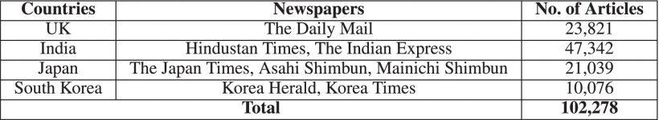

<!-- tex script for md -->

# 週次報告書 2021年09月30日
AL18036 片岡 凪

## 1. 今回の報告会までに実施する予定だったこと
- 予備実験
    - 既存プログラムのモジュール化
        - 記事のデータセットの調査
        - ~~EvidenceとClaimの分類~~
    - ~~クラスタリングの実装~~
- ~~思考実験~~
    - 報告会の振り返り
        - 主張と出来事のクラスタリングの順序の是非
        - 分類とクラスタリングの仮説の設定

## 2. 実施内容

### 2.1 記事データセットをCOVID-19に限定して決定
前回に引き続き複数の国の同時期のデータセットを数百件調査したが、要件に合うデータが見つからなかった。

> 前回述べた要件
> 1. 収集方法が近しい3言語以上のデータセットであること
> 2. 一ヵ月以内の狭い範囲の網羅性の高いデータセットであること
> 3. 人気記事などの変なソートが入っていない or 入っていても除去できるデータセットであること

そこで、出来事を特定の時事に絞り、要件2の網羅性を高めて再調査した。
時事としては、1年と10カ月前から現在にかけて流行しているCOVID-19を選択した。
COVID-19は関連政策の定石が定まっておらず、また治療法などのフェイクニュースも多い。
従って、同じ出来事の異なる主張が多く得やすいという点でも本研究の目的に適していると考える。

出来事を特定の時事に絞るとき、以下のいずれかを検討する必要がある。

1. 全カテゴリの記事から特定の記事のデータセットを作成する方法を考える
2. 特定時事から2回のクラスタリングを行っても全カテゴリから2回のクラスタリングを行っても結果に大差がないと説明する
3. 研究目的を特定時事のデータセットの使用を前提とする

3 で行い、考察として2を述べても良い。

1 はSentence-BERTと出来事の文のクラスタリングを行えば可能であるが、その後全く同じ2操作を行うことになる。
このとき、2回目にできたクラスタは1回目にできたクラスタのサブクラスタとなるはずである。
これは2の説明にもなっており、より操作の少ない2の方が本研究に適しているといえる。
3よりも2の方が一般性が高く、より価値のある研究になると考える。

COVID-19に限定して調査したところ、
[COVID-19 News Articles](https://ieee-dataport.org/documents/covid-19-news-articles)
というデータセットが要件を満たしていた。
具体的には以下の表のように、多国籍の他者の多くの本文データを有している[1]。本文は英語で記述されている。

記事の出稿日は2020年1月1日から同年12月1日であった。
ライセンスは営利目的であっても再配布可能なCC BY 4.0であった。
また、80件の論文が本データセットを引用しており、ある程度の信頼性がある。
データはカンマなどにエスケープ処理？が施されていたため、これを除去して利用する予定である。
（何のためのエスケープ処理なのでしょうか。除去する必要はあるのでしょうか）

[1] [P. Ghasiya and K. Okamura, "Investigating COVID-19 News Across Four Nations: A Topic Modeling and Sentiment Analysis Approach," in IEEE Access, vol. 9, pp. 36645-36656, 2021, doi: 10.1109/ACCESS.2021.3062875.](https://ieeexplore.ieee.org/abstract/document/9366469)

### 2.2 和歌山サーバーにリモートデスクトップ接続した
特筆事項なし

### 2.3 東京サーバーに接続し、ファイル構造を把握した
特筆事項なし

## 3. 次回までに実施予定であること
- 予備実験
    - 既存プログラムのモジュール化
        - 記事のデータセットの調査
        - EvidenceとClaimの分類
    - クラスタリングの実装
- 思考実験
    - 報告会の振り返り
        - 主張と出来事のクラスタリングの順序の是非
        - 分類とクラスタリングの仮説の設定

## 4. 雑多メモ
- 記事データセット
    - 「news language」で検索
        - A Multidimensional Dataset for Analyzing and Detecting News Bias based on Crowdsourcing
            - 90記事
            - 2057文章
            - ニュースバイアスに関して
            - ウクライナ危機
            - 33か国
            - 手動アノテーション済み
            - 所感
                - ウクライナの記事は特定問題として研究目的に沿っている
                - ウクライナ以外からウクライナの出来事を絞る実験は別に必要
        - JRC-Names RDF: Person and organisation spelling variants as found in multilingual news articles
            - 異表記の学習
        - TAUS Language Translation Data | Parallel translation for Covid-19, Medical and Healthcare, various languages for Machine Learning
            - 5万円
            - 医療系
            - オランダ、デンマーク、日本、ポルトガル、オーストラリア、ポーランド、ドイツ、チェコ共和国、米国、スペイン
    - 「news japanese english」で検索
        - 12件
        - 該当なし
    - 「news multilingual」で検索
        - 15件
        - 該当なし
    - 「news」で1カ月以内検索
        - 89件
        - 該当なし
    - 「news COVID multi」で検索
        - 44件
        - newsが少なすぎる
    - 「news COVID」で1年以内検索
        - 100件
        - COVID-19 Real News Data of CBC News
            - 202001-05
                - 2012-2019が僅かに含まれており、少しあやしいデータ
            - 説明が少ない
            - kaggleの元データにアクセスできない
        - [COVID-19 News Articles](https://ieee-dataport.org/documents/covid-19-news-articles)
            - IEEE DataPort
                - 月4000円
                - 個人利用は無期限の期間限定無料
            - 引用80件
            - CC BY 4.0
                - 再配布まで自由
            - エスケープ処理が必要そう
            - 英訳済み
            - [P. Ghasiya and K. Okamura, "Investigating COVID-19 News Across Four Nations: A Topic Modeling and Sentiment Analysis Approach," in IEEE Access, vol. 9, pp. 36645-36656, 2021, doi: 10.1109/ACCESS.2021.3062875.](https://ieeexplore.ieee.org/abstract/document/9366469)
                - 20200101-20201201
                - 新聞既知
                - 記事数が国によっては4倍の差がある
    - 「news multi sources」で検索
        - 16件
        - 該当なし
    - 「news sources」で検索
    - 「news week sources」で検索
    - 「news site dataset」で検索
        - 
    - 先週見つけたデータセットの深堀り
        - Internet news data with readers engagement
            - サイトの種類が多すぎる
            - 本文が全て載っていない
        - Popular News articles
            - webhose
        - News Aggregator
            - サイトの引用元が不明？
        - A Data set for Information Spreading over the News
            - カテゴリごとにデータが分割されすぎている？
        - World news articles
            - 1000クエリ以上は有料？
            - 説明不足
        - WMT 2018 News Dataset
            - 出稿日の範囲が不明
        - FLORES-101
            - 容量が少なすぎた
            - 記事のデータセットではない
        - News Dataset
            - https://dataverse.harvard.edu/dataset.xhtml?id=3010077
            - 3800件
            - 時期が不明
    - それだけに頼るのも微妙
    - IEEE DataPortで「news」で検索
        - 該当は上記1件のみ
- ある程度のカテゴリは絞ってよい？
    - 出稿時に執筆者がつける
    - ひとつのバイアスになる？
- 異国の英語間のデータで良いのか
    - 英語が通じるニュースはお互い読めてしまっている？
- 東京サーバー
    - windowsは\\はじまり
    - ipadはESファイルエクスプローラーでsmb://はじまり
- [paperswithcode](https://paperswithcode.com/)
    - 絞り込みが楽
        - text classification
            - 該当なし
        - document classification
            - MPQA Opinion Corpus
                - 535記事は少ない印象
                - 手動アノテーション
                    - 意見、信念、感情、推測など
        - news classification
            - 該当なし
        - news recommendation
            - ~~MIND datasets~~
                - 本文なし
        - misinformation
            - NELA-GT-2020
                - 180万件
                - 20200101-1231
                - 真偽のラベル
                    - Media Bias/Fact Check（MBFC）
        - rumour detection
            - 噂
            - FTR-18
                - フットボール
                - 3言語
                - arxivにある
        - sarcasm detection
            - 皮肉
