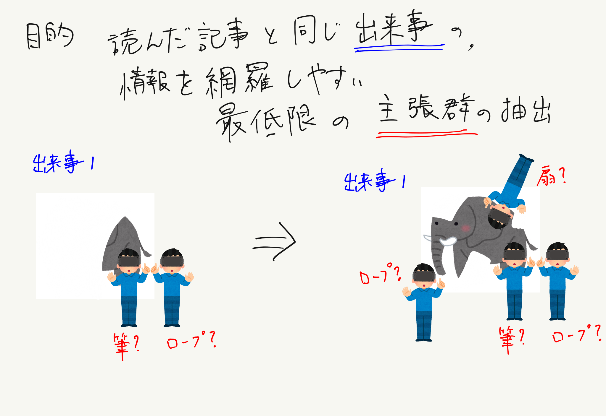
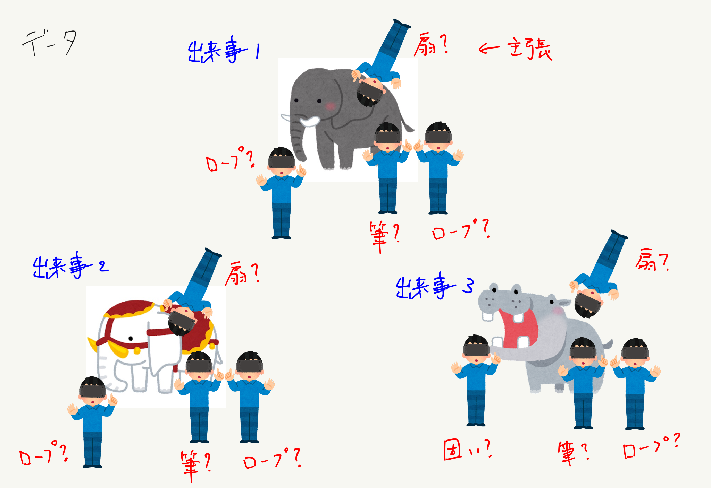
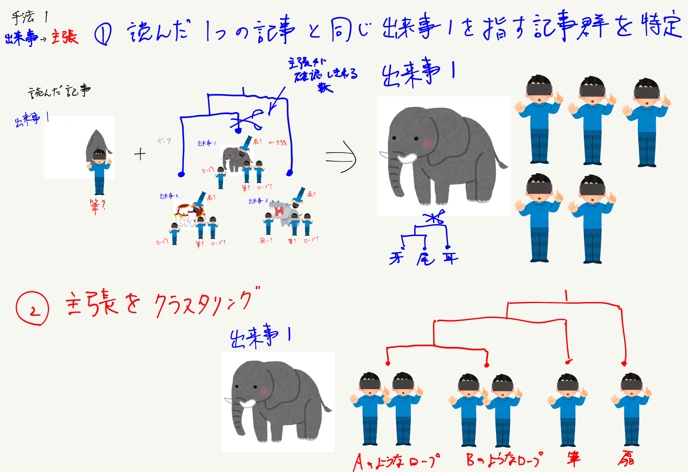
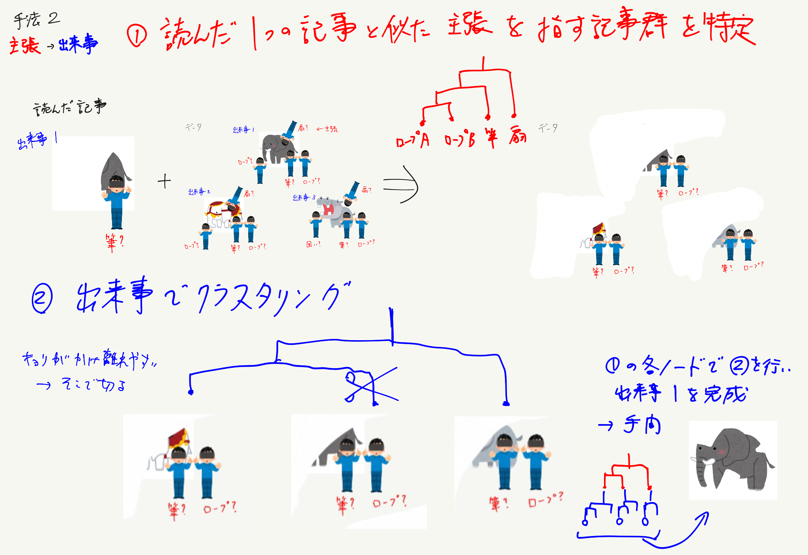
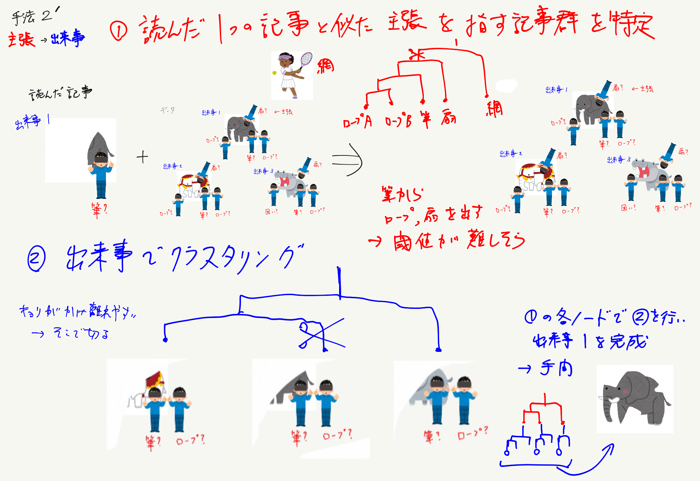
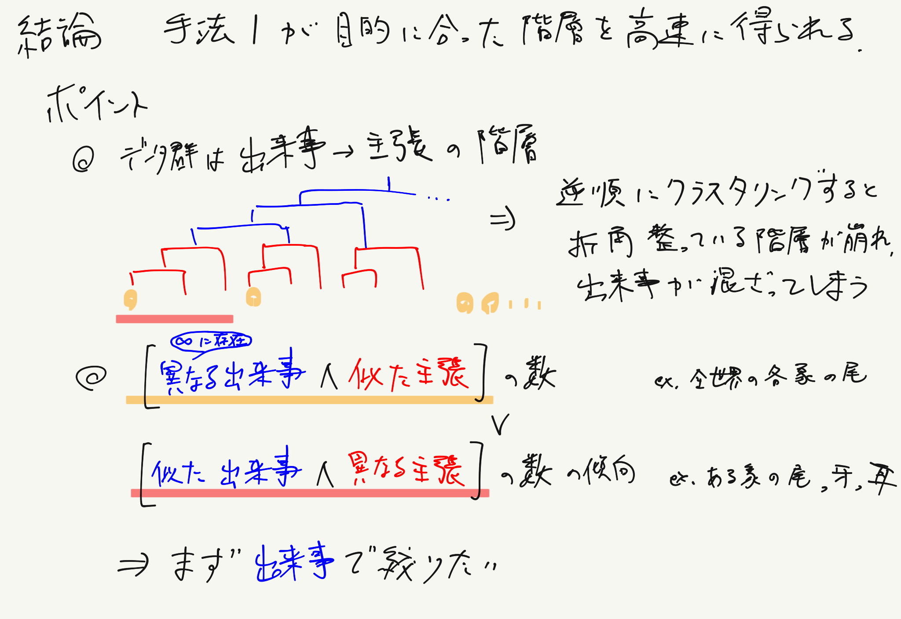

<!-- tex script for md -->

# 週次報告書 2021年10月07日
AL18036 片岡 凪

## 1. 今回の報告会までに実施する予定だったこと
- 予備実験
    - データの前処理
    - ~~EvidenceとClaimの分類~~
    - ~~クラスタリングの実装~~
        - 手法を詰める
- 思考実験
    - 報告会の振り返り
        - 主張と出来事のクラスタリングの順序の是非
        - 分類とクラスタリングの仮説の設定

## 2. 実施内容

### 目次
- 2.1 クラスタリングを出来事→主張の順に決定
- 2.2 COVID-19 News Articlesの前処理2つに設定

### 2.1 クラスタリングを出来事→主張の順に決定

研究目的とデータの特徴を整理し、クラスタリングの順序を再考した。

研究目的は、「読んだ記事と同じ出来事について、情報を網羅しやすい最低限の主張の文を抽出すること」である。
ここで、記事群が出来事の階層構造とその葉ノードに接続する主張の階層構造に構造化できると仮定する。
そして、読んだ記事が属する葉ノードに近い葉ノードを、一般的な読者が確認し得る数だけ推薦する。ここでは、最大30個の主張の葉ノードを想定する。最終的には主張の文でクラスタリングしているため、1つの記事は複数の葉ノードに属する可能性がある。

出来事のクラスタリングをどの粒度まで行うかは要検討である。図1のように、対象物は同じで、着眼点となる部位などは異なる程度が良いのではないかと考えている。

評価としては、クラスタリング結果が似た出来事・主張同士で正しくまとまっているかと、近い葉ノード同士で似て異なる記事・文章となっているかを確認したい。
葉ノードの主張の文同士のクラスタリング精度は文章推薦のベンチマーク、出来事として記事同士のクラスタリング精度は記事推薦のベンチマークを利用しようと検討している。

分類とクラスタリングの仮説立てがまだ曖昧な気がするので、何を仮説立てするべきかのご助言を賜りたい。

図1：目的

記事データの抽出元として、異なる文化地域から、実用上処理しきれる数の出版社を選択する。
簡単のため、事前に単語検索などのアルゴリズムでカテゴリを限定する。
ここでは動物のカテゴリで話すが、実際にはCOVID-19をカテゴリとして扱う。

クラスタリングの順序を再考するにあたって、似て非なる像同士や、主張が似ている異なる出来事などの存在を検討した。

図2：手法1

手法1として、卒研1と同じく出来事の文章、主張の文の順にクラスタリングする手法について考える。
このとき、事前に構築した出来事のクラスタから、読んでいる記事が属するサブクラスタを選択する。
次に、選択したサブクラスタを主張の文を元にクラスタリングする。
この手法1は図1の目的に沿っている。

図3：手法2

手法2として、主張の文、出来事の文章の順にクラスタリングする手法について考える。
主張の文は出来事が異なっても似通う可能性があるので、先に主張の文のクラスタリングを行うと図3のように出来事が混合すると考える。出来事が似ないカバが混合する可能性も高い。

図4：手法2'

図5：結論

### 2.2 COVID-19 News Articlesの前処理
記事データは、国や出版社によってエスケープ処理に統一性がなく、前処理に手間がかかるものであった。
従って、当分は比較的前処理のしやすいイギリスと韓国で実験を進め、後に他の言語を処理するのが適当かと考えている（暫定）。

## 3. 次回までに実施予定であること
- 予備実験
    - データの前処理
    - EvidenceとClaimの分類
    - クラスタリングの実装
        - 手法を詰める
- 思考実験
    - 報告会の振り返り
        - 分類とクラスタリングの仮説の設定

## 4. メモ
- 前処理
    - 国や出版社によってエスケープ処理がバラバラで前処理しにくい
        - イギリス
            - 
        - インド
            - 絵文字が多い
        - 日本
            - CRLFがあったりなかったり
        - 韓国
            - 本文が囲われていない
        - とりあえず前処理しやすいイギリスでやってみるか
    - 論文記載の処理
        - 短縮形の展開
            - されてなくね
        - ストップワードの除去
            - NLTKライブラリ
            - by, ofなど？
            - 必要だと思うが
        - 特殊文字の除去
            - 絵文字などがあった
            - ❤️
        - 小文字に変換
        - 図2に処理手順が記載
- 論文のtop2vec、使えそう
    - SBERTとどちらが良いか
    - 前処理（ストップワードの除去，ステミング，レマタイズ）を必要としない
