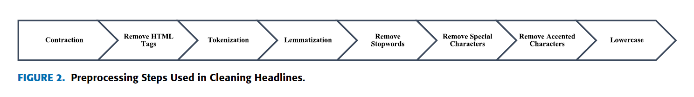

<!-- tex script for md -->

# 週次報告書 2021年10月13日
AL18036 片岡 凪

## 1. 今回の報告会までに実施する予定だったこと
- 予備実験
    - (データの前処理)
    - ~~EvidenceとClaimの分類~~
    - ~~クラスタリングの実装~~
        - 手法を詰める
- 調査
    - 前処理済みの文字化けデータの読み取り
    - 前処理前のデータをExcel読み取り
    - データセットの元論文
    - BERT特有の前処理方法がないか
<!-- - 大学依頼の就活体験記 -->
<!-- - 会社のアンケート関係 -->

## 2. 実施内容

### 2.1 前処理済みの文字化けデータの読み取り
データセットのうち、前処理済みだと思われる文字化けファイル「Japan_Covid-19_Top2Vec_model（拡張子なし）」の読み取りを試みたが**失敗した**。
サクラエディタやWeb上の文字コード解析ツールを使用したが、多少マシになった程度で大半が化けたままであった。
データセットの元論文を全て読んだが、ファイルについての詳細の記載はなかった[1]。
そもそも文字化け部分の1行あたりの文字数が少ないため、**人間が解析できないtop2vecのモデル情報だと判断**し、読み取りを**断念することにした**。

[1] [P. Ghasiya and K. Okamura, "Investigating COVID-19 News Across Four Nations: A Topic Modeling and Sentiment Analysis Approach," in IEEE Access, vol. 9, pp. 36645-36656, 2021, doi: 10.1109/ACCESS.2021.3062875.](https://ieeexplore.ieee.org/abstract/document/9366469)

元論文を読んだ副産物として、**本研究と少し似た「文脈情報と感情情報」を利用した推薦手法の情報**が得られた。
クラスタリングする際に軽く確認したい。
また、**BERT用の前処理の手順の記載**があり、参考になると考えた。
ただし、何のために前処理しているかの記載がなく、鵜呑みにするのは不適切だと考える。
特に、**BERTに関して特殊な前処理が必要な可能性**があるため、**調査してから前処理をしたい**。

### 2.2 前処理前のデータをExcel読み取り
前処理前のデータ「Japan_Articles.csv」の記号がソフトだけで完全に除去できないかを試し、**一部成功**した。
まず、Googleスプレッドシートへのインポートを行ったが何も改善しなかった。
Excelの設定を見直したところ、**BOM付きデータ**に保存し直すことで文字化けが改善し、適切な位置でデータが区切れるようになった。
これにより、**Excelの関数で大方の前処理が簡易的に可能**となった。

### 2.3 BERT特有の前処理方法がないか調査
まず、**基本的なNLPの前処理**について、種類とそれぞれの効果を調査した。
具体的には、記号のクリーニング、正規化、省略語、口語、ストップワードについて理解を深めた[2]。
また、Beautiful Soupやlxml、NLTKなど、安心して処理できる様々なライブラリの存在を知り、使用を検討したいと考えた。
ただし、前回の記号を除去する程度の処理であればExcelで十分に処理が可能である。

[2] [Hiroki Nakayama (2017) 自然言語処理における前処理の種類とその威力](https://qiita.com/Hironsan/items/2466fe0f344115aff177)

次に、BERTに特化した前処理について、**Googleで検索**を行ったが、**良い結果は得られなかった**。
検索ワードとしては「BERT、RoBERTa、前処理、クリーンアップ、preprocessing、cleanup、text」などを組み合わせた。
しかし、埋め込み部分の表現形式などといったモデルに近い処理ばかりがヒットしてしまい、欲しい情報は得られなかった。
**より適当な検索ワードがあればお聞きしたい。**

Google検索をしているうちに、「ストップワード除去だけするのが良い」との記述や、論文を引用しつつ「ストップワードの除去は不要だ」と述べる記事に行きついた。
引用された論文が4ページであり、タイトルも有用そうであったため、さらっと読んでみることにした。
論文によると、**ストップワード除去の有無でBERTのランキングタスクによるMRR（Mean Reciprocal Rank）という評価指標に変化はない**とのことであった[3]。
ランキングタスクは分類タスクや分散表現とは少し異なるため、前処理手法については**更なる調査が必要**である。
また、RoBERTaのケースについても調査をしたい。

[3] Y. Qiao, C. Xiong, Z. LiuとZ. Liu, 「Understanding the Behaviors of BERT in Ranking」, arXiv:1904.07531 [cs], 4月 2019, 参照: 10月 11, 2021. [Online]. Available at: http://arxiv.org/abs/1904.07531

前処理の調査について、次はTransformer, BERT, RoBERTa, S-BERTの**元論文を参照**しようかと考えている。
軽く目を通した程度では前処理に関する記述は見受けられなかった。
これらの元論文は本論を書き上げる前に1度は読んでおきたいと考えており、早いほど良いと考えている。

一方で、実装時に前処理手法がわかる可能性や、前処理以外で手戻りする問題が発生する可能性もあるため、とりあえず**簡単な前処理で進める**のが一番正しいとも考えている。
簡単な実装としては、英数字以外の除去（カンマ含む）、改行の除去、小文字化、先頭の余分な情報の除去であり、ストップワードや数字の統一（1-9 → 0）はとりあえず考えない。

## 3. 次回までに実施予定であること
- 予備実験
    - (データの前処理)
    - EvidenceとClaimの分類
    - クラスタリングの実装
        - 手法を詰める
- 調査
    - BERT, RoBERTaの前処理
        - Transformer, BERT, RoBERTa, S-BERTの元論文を読む？
<!-- - サークルのLT準備
- ゲームカンファレンスの視聴とレポート作成 -->

## 4. メモ
- modelファイルの読み取り再挑戦
    - サクラエディタはだめだった
    - Webの文字コード判別もだめだった
    - そもそも途中から文字数が
- エスケープの再読取り
    - Excelの設定を見直したがだめだった
    - スプレッドシートでもだめだった
    - BOMで一部改善
- データセットの論文を読み込む
    - [1] [P. Ghasiya and K. Okamura, "Investigating COVID-19 News Across Four Nations: A Topic Modeling and Sentiment Analysis Approach," in IEEE Access, vol. 9, pp. 36645-36656, 2021, doi: 10.1109/ACCESS.2021.3062875.](https://ieeexplore.ieee.org/abstract/document/9366469)
    - 似た研究を見つけた
        - Huangら[22]
            - **文脈情報と感情語の感情情報の両方を使用**
                - 感情分析
                - センチメント・コンボリューショナル・ニューラル・ネットワーク
- BERT分類で必要な前処理を調査
    - ストップワードだけに留めるのが良いとどこかに書いてあった
        - リファレンス無し
    - [自然言語処理における前処理の種類とその威力(2017)](https://qiita.com/Hironsan/items/2466fe0f344115aff177)
        - クリーニング
            - HTMLタグなど
            - URL
            - メンション
            - 記号
        - 正規化
            - 小文字に統一
            - 数字を0のみにする
                - カテゴリの分類には不要
            - 同じ意味の単語をひとつの単語に変換
        - 省略語を戻す
        - 口語を戻す
        - ストップワード
            - 機能語
                - 助詞
                - 助動詞
            - 出現頻度が高いものを除去することも
    - [1]Y. Qiao, C. Xiong, Z. LiuとZ. Liu, 「Understanding the Behaviors of BERT in Ranking」, arXiv:1904.07531 [cs], 4月 2019, 参照: 10月 11, 2021. [Online]. Available at: http://arxiv.org/abs/1904.07531
        - 所感
            - 前処理が知りたくて読んだが、あまり記載なし
                - RoBERTaでどうかも調査が必要
            - ランキングの専門外の内容が多い印象
        - 重要ピックアップ
            - BERT
                - 文脈に強い
                - クリックタスクに弱い
            - CLSトークンはベクトル
            - ストップワードの除去は不要
- S-BERTで必要な前処理を調査
- 大学に依頼された就活体験記を書いた
- 会社のアンケート関係を終わらせた
