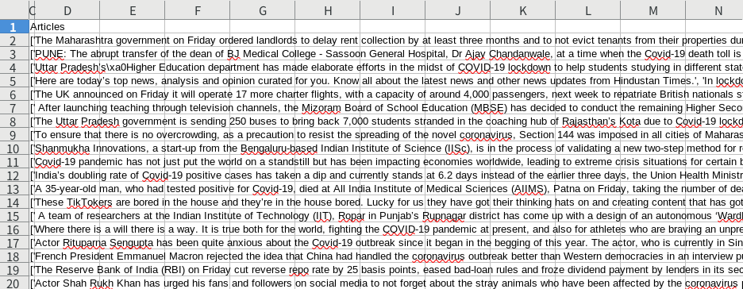
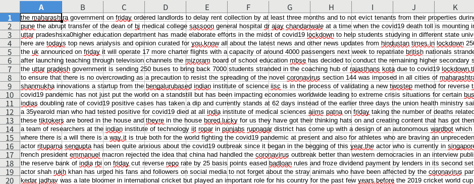
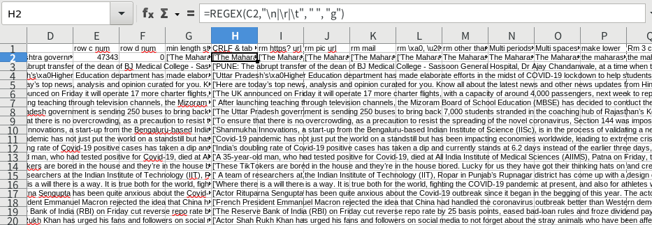

<!-- tex script for md -->
<script type="text/javascript" async src="https://cdnjs.cloudflare.com/ajax/libs/mathjax/2.7.7/MathJax.js?config=TeX-MML-AM_CHTML">
</script>
<script type="text/x-mathjax-config">
 MathJax.Hub.Config({
 tex2jax: {
 inlineMath: [['$', '$'] ],
 displayMath: [ ['$$','$$'], ["\\[","\\]"] ]
 }
 });
</script>

# 週次報告書 2021年10月28日
AL18036 片岡 凪

## 1. 今回の報告会までに実施する予定だったこと
- 予備実験
    - データの前処理
    - ~~EvidenceとClaimの分類~~
    - ~~クラスタリングの実装~~
        - 手法を詰める

## 2. 実施内容

### 目次

### 2.1 データの前処理
正規表現を学び、検討していた前処理の大部分がこれで解決できることが判明した。
VSCodeの検索機能とLibreOfficeのテストケースで確認しつつ、LibreOfficeの置換機能で前処理を行った。


<div style="text-align: center;">
図1. 処理前のインドの記事データ
</div>
<br>
<br>


<div style="text-align: center;">
図2. まず全ての前処理を行った結果
</div>
<br>
<br>

学ぶにあたり、URLとメールアドレスが
```
https?://([\w-]+\.)+[\w-]+(/[\w-./?%&=]*)?
\w+([-+.]\w+)*@\w+([-.]\w+)*\.\w+([-.]\w+)*
```
で除去できると判明したため、すぐに処理ができた。

また、`http`ではなく`pic`から始まるリンクが多く見受けられたため、上記の正規表現を参考にして
```
pic\.([\w-]+\.)+[\w-]+(/[a-zA-Z0-9-./?%&=]*)?
```
で1071件のリンクを除去した。
`http`以外の汎用的なリンクにも対応したかったが、
```
... lockdown.The ...
pic.twitter.com/5DH9fjNshQ', 'However, members
```
のような様々なケースで上手く機能しなかったため見送ることにした。

電話番号の除去も10件ほどの正規表現で試みたが、国際電話はパターンが多く、
```
8-10
2021-22
```
といった日付などの表現を回避する除去ができなかったため、見送ることにした。

次に、CRLFとtabを
```
[\n\r\t]
```
で除去した。


また、`\xa0`(no brake space) や`\u2009`(thin space)といった文字コード由来のノイズを
```
\\[a-zA-Z]+[0-9]+
```
で除去した。

また、文字、スペース、コンマ以外の文字を
```
[^\w\s\.]
```
で除去した。

次に、LibreOfficeの機能で大文字を小文字に変換した。

また、連続するカンマやスペースを
```
\.{2,}
\s{2,}
```
で除去した。

次に、`U.S.`や`F.R.I.E.N.D.S.`といった省略のピリオドを
```
\s(.)\.(.)\.(.)\.(.)\.(.)\.(.)\.(.)\. -> $1$2$3$4$5$6$7
\s(.)\.(.)\.(.)\.(.)\.(.)\.(.)\. -> $1$2$3$4$5$6
\s(.)\.(.)\.(.)\.(.)\.(.)\. -> $1$2$3$4$5
\s(.)\.(.)\.(.)\.(.)\. -> $1$2$3$4
\s(.)\.(.)\.(.)\. -> $1$2$3
\s(.)\.(.)\. -> $1$2
\s(.) -> $1
^(.)\.(.)\.(.) -> $1$2$3
^(.)\.(.) -> $1$2
^(.) -> $1
```
の順に除去した。
この操作を逆順に実行すると、先頭から処理が進んだ場合に末尾側のピリオドが除去しきれない。
また、$8まで行うと一致0件となるため、$7から処理している。

省略のピリオドが存在した場合、文の区切りが正しく判定できず、分類器に入力する前の文章の分割ができなくなる。
しかし、上記の正規表現では`Dr.`や`Tues.`といった2文字以上の省略文字では判別できない。
1文字の制限がないと、文末のピリオドとの区別が難しい。
これを解決するため、Google Search、Google scholor、IEEE Dataport、paperswitchcodeなどで
```
「abbreviation period dataset」
「略語 展開 python」
「python abbreviation period」
「abbreviation period detection」
「abbreviation period corpus」
```
など様々な検索ワードで検索をかけたが、期待する処理手法を見つけることができなかった。
重要な処理であるため、木村先生や杉本先生に相談してでも解決したい内容だと考えている。
ただし、先の実装を進めてから処理してもタイムロスが少ないため、まずは見送ろうと考えている。

次に、ピリオドの前後に空白が存在するケースが見受けられたため、
```
\s\.\s|\s\.|\.\s -> .
```
で除去した。

また、行頭にスペースやピリオドが存在するケースが見受けられたため、
```
^\s
^\.+
```

なお、実装途中でREGEX関数の存在を知り、前処理の挿入が可能だと判明した。
先述の`\xa0`などの処理は実装途中で処理が可能だと判明したため、REGEX関数を用いて図3のように処理し直した。


<div style="text-align: center;">
図3. `\xa0`などの処理を追加しつつ関数で前処理した結果
</div>
<br>
<br>

関数を用いた場合、コピーに時間がかかり、フリーズしてしまった。
調査したところ、GPUを設定して高速化できそうだと判明したため、設定を行った。

以上の処理をしている際、イギリスの記事にピリオドが存在せず、文の分割ができず利用不可なデータであることが判明した。
今後は日本、韓国、インドの3か国のデータで処理を進める予定である。

### 2.2 GPUの設定
志田君の資料を参考にGPUのドライバーをインストールした。
引き続きCUDAの設定を行う予定である。

## 3. 次回までに実施予定であること
- 予備実験
    - CUDAの設定
    - 2文字以上の省略のピリオドの除去？
    - EvidenceとClaimの分類
    - クラスタリングの実装
        - 手法を詰める

## 4. メモ
- スプレッドシートは正規表現の関数がある
    - REGEX
    - 大容量データは重すぎて使い物にならない
- Libre日本語化
    - sudo apt install libreoffice libreoffice-l10n-ja libreoffice-help-ja
- Libreを最新版にすることでREGEX関数に対応できた
    - https://sicklylife.hatenablog.com/entry/2015/08/08/131922
    - sudo add-apt-repository ppa:libreoffice/ppa
    - sudo apt-get update
    - sudo apt-get dist-upgrade 
- 前処理
    - 本文の列のみのCSVファイルの作成
        - 新規Libreにコピー
    - URLの削除
        - https?://([\w-]+\.)+[\w-]+(/[\w-./?%&=]*)?
            - インド855件
            - 韓国80件
            - 日本242件
            - イギリス0件
        - httpから始まらないリンクも
            - インド1502行 pic.twitter.com/j6dz...
                - 文章分類の際に「pic.」「twitter.」といった短い文章が生成されてしまう
                - ([\w-]+\.)+[\w-]+(/[\w-./?%&=]*)?
                - インド1435件
                    - 3.75%などが反応してしまうのでボツ
                - [a-zA-Z]([\w-]*\.)+[\w-]+(/[\w-./?%&=]*)?
                    - VSCodeだと後半の\wでエラーになる
                        - [a-zA-Z]([\w-]*\.)+[\w-]+(/[a-zA-Z0-9-./?%&=]*)?
                    - ... lockdown.The ... など、ピリオドの後にスペースがないと反応してしまう
                - \bpic\..*\b
                    - pic.twitter.com/5DH9fjNshQ', 'However, membersのように続いてしまう
                - pic\.([\w-]+\.)+[\w-]+(/[\w-./?%&=]*)?
                    - pic\.([\w-]+\.)+[\w-]+(/[a-zA-Z0-9-./?%&=]*)?
                        - インド1056件
                            - VSCodeと違う値？？
                            - 前処理前後の違いかも
                        - 日本15件
                        - 韓国0件
                        - イギリス0件
    - Unicodeのノイズ
        - \xa0
            - [空白](https://www.webdevqa.jp.net/ja/python/python%EF%BC%9A%E6%96%87%E5%AD%97%E5%88%97%E3%81%8B%E3%82%89-xa0%E3%82%92%E5%89%8A%E9%99%A4%E3%81%97%E3%81%BE%E3%81%99%E3%81%8B%EF%BC%9F/1066631904/)
        - \u2009Bolt
            - インド1097行
            - とりあえず無視
    - @TwitterID
        - 文章の中に独立で存在し、似た文章として推薦される可能性が少ないため処理はせず無視
    - メアドの削除
        - \w+([-+.]\w+)*@\w+([-.]\w+)*\.\w+([-.]\w+)*
        - インド208件
        - 韓国2071
        - 日本21件
        - イギリス0件
    - HTMLタグの削除
        - <("[^"]*"|'[^']*'|[^'">])*>
        - インド52件
            - HTMLタグではなく、<city name>というような言葉がヒット
                - 3件確認
                - でないので処理せず無視
                - 他の国は少ない
    - 電話番号の除去
        - 数字とハイフンの組
        - Covid-19、20-days、8-10、2021-22などがひっかかりがち
        - \+?(\d+-)+\d+
            - アドリブ
        - いろいろ試したけど駄目そう
            - [電話番号の正規表現はどうしたらいいのか](https://akinov.hatenablog.com/entry/2017/05/31/194421)
        - とりあえず処理しないとく
    - 英数字・ピリオド・空白以外の除去（カンマは除去）
        - [^\w\s\.]
        - インド47342件
        - 韓国10076件
        - 日本21038件
        - イギリス件
    - 連続ピリオドを1つのピリオドに
        - \.{2,}
        - インド1095件
        - 韓国263件
        - 日本1032件
        - イギリス0件
    - 連続した空白を1つの空白に
        - \s{2,}
        - インド4880件
        - 韓国2723件
        - 日本12724件
        - イギリス22件
    - 省略のピリオドの除去
        - 連続した省略のピリオド
            - \s(.)\.(.)\.(.)\.(.)\.(.)\.(.)\.(.)\.
                - [スペース]$1$2$3$4$5$6$7 に変換
                - 先頭はスペースか行頭
                - 徐々に減らしていく
                - インド1+1+6+4+47+1052+1380件
                - 韓国3+18+1619+2363件
                - 日本6+68+2342+1746件
                - イギリス0件
        - 先頭の省略
            - ^(.)\.(.)\.(.)\.(.)\.(.)\.
                - $1$2$3$4$5 に変換
                - 徐々に減らしていく
                - 括弧がないと不可
                - インド15+4件
                - 韓国77+2件
                - 日本1+23+4件
                - イギリス0件
                    - UKのデータは最初からピリオドがない
                        - 今更気付いた
                        - 文章分割できない
                            - 使用不可
    - ピリオドの前後の空白を除去
        - \s\.\s|\s\.|\.\s
            - .に変更
        - インド47338件
        - 韓国10032件
        - 日本21031件
        - イギリス0件
    - 行頭のスペースを除去
        - ^\s
        - インド1496件
        - 韓国37件
        - 日本11884件
        - イギリス0件
    - 先頭のピリオドの除去
        - 韓国の38行目などに何故か生じていた
        - ^\.+
        - インド0件
        - 韓国2件
        - 日本0件
        - イギリス0件
    - 小文字化
        - 書式 → テキスト→ 小文字
    - データの見直し
        - 各記事10件見た
            - インド
                - 2行目
                    - dr.など2文字の省略後などが処理できてない
                - 3行目
                    - pradeshsxa0higher
                        - Unicodeのタグ
                        - インド20000件以上
                        - 日本4778件
                        - 韓国0件
                        - イギリス0件
                        - \\[a-zA-Z]+[0-9]+
                            - スペースに変更
                            - 連続スペース除去の前に処理
                                - URL除去の直後に処理
            - 韓国
            - 日本
            - イギリス
    - 2文字以上の省略のピリオドの除去
        - 文字数制限がないと文末のピリオドとの区別がつかない
            - コーパスを使うしかない？
                - 「abbreviation period dataset」で検索
                    - Google Search
                    - Google scholor
                    - IEEE Dataport
                    - paperswitchcode
                - 「略語 展開 python」
                - 「python abbreviation period」
                - 「abbreviation period detection」
                - 「abbreviation period corpus」
        - 正規表現
    - 行のシャッフル
        - python
        - Libreでできる？
    - BOMなしの1列のCSVに保存？
        - 空行チェックはソート機能で
            - 空行でない行は削除
            - ExcelではD列に溢れていたのがLibreでは溢れず
- GPU setup
    - Libre
- フリーズした
    - CUIでsudo rebootをかけたら直った
