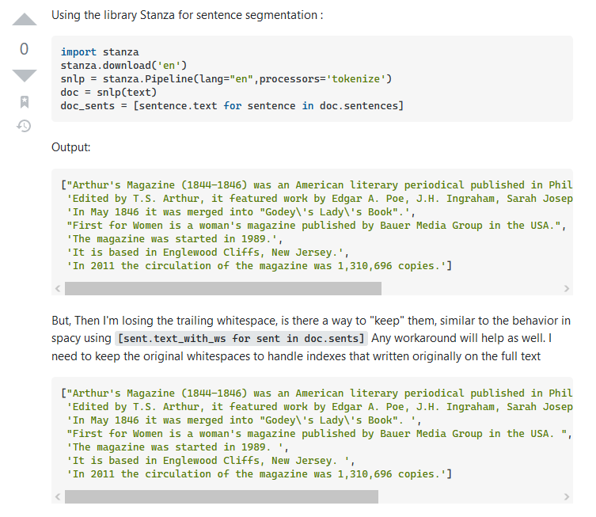
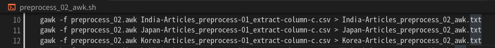
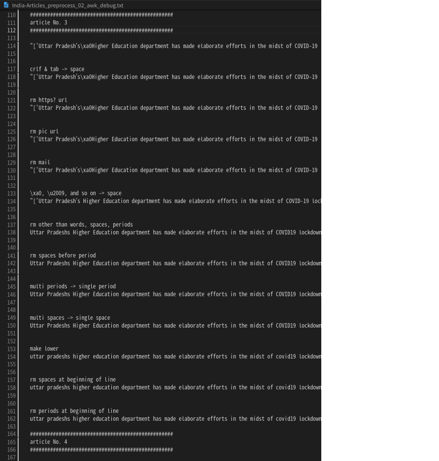
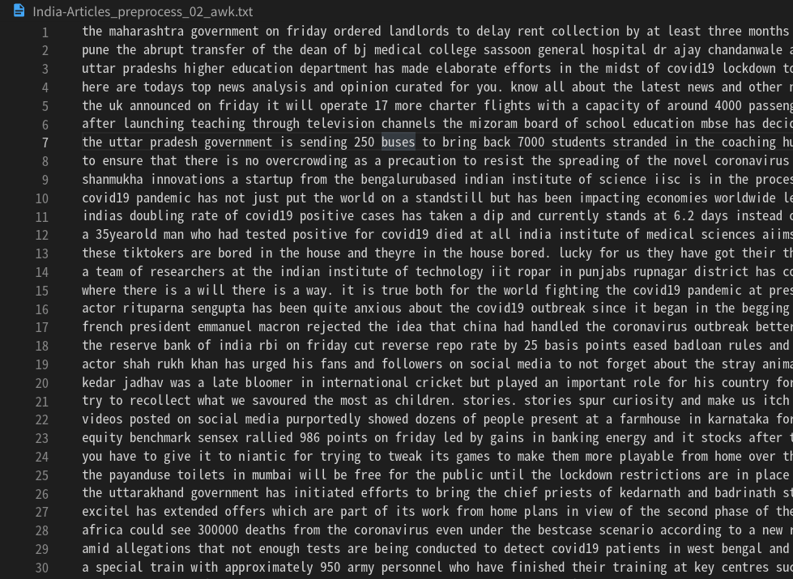

<!-- tex script for md -->
<script type="text/javascript" async src="https://cdnjs.cloudflare.com/ajax/libs/mathjax/2.7.7/MathJax.js?config=TeX-MML-AM_CHTML">
</script>
<script type="text/x-mathjax-config">
 MathJax.Hub.Config({
 tex2jax: {
 inlineMath: [['$', '$'] ],
 displayMath: [ ['$$','$$'], ["\\[","\\]"] ]
 }
 });
</script>

# 週次報告書 2021年11月10日
AL18036 片岡 凪

## 1. 今回の報告会までに実施する予定だったこと
- 予備実験
    - 省略のピリオドの識別
        - Dr. U.S.など
    - 表示機能のない置換処理の検討
        - sed, awkなど
    - 文章分割
    - ~~EvidenceとClaimの分類~~
    - ~~クラスタリングの実装~~

## 2. 実施内容

### 目次
- 2.1 中村先輩の卒論を読む
- 2.2 Stanzaを用いた「省略のピリオドを考慮した文章分割」の検討と実装（WIP）
- 2.3 bashとgawkを用いた置換処理の実装

### 2.1 中村先輩の卒論を読む
卒論執筆の参考のため、自分に近い自然言語処理に関する研究をした中村先輩の論文を拝読した。
**論文の構成、文量、読みやすくなりそうな書き方**などがわかった。
評価のために手法間の類似度の相関係数を取られていたが、提案手法の精度が悪かったとしても類似度の昇降が一致すれば相関係数は高くなってしまうため、この提案手法の評価に相関係数を用いるのは不適だと考えた。

報告会の途中に「**卒論に勉強した内容を含めて良い**」との内容がありましたが、その範囲をお聞きししたいです。
**「awkで詰まった点」のような「使用ツールの使い方」や「苦労した点」は、学術論文としては良くないイメージがあるが、卒論としては書いてよいでしょうか。**それとも「機械学習モデルの構造」のような「他の論文で提案された手法」の説明に留めるのが良いでしょうか。

また、**使用したツールやPCスペックはどのレベルまで書くか**といった指標はありますでしょうか。

### 2.2 Stanzaを用いた「省略のピリオドを考慮した文章分割」の検討と実装（WIP）
省略のピリオドなどを考慮した文章分割手法を考えるため、まず省略のピリオドのいくつかの**パターンを列挙**した。

1. ~ is end. S.I.T. is ~
2. ~ is end. I am S.I.T. of ~
3. ~ is end. It is S.I.T. Then, ~
4. ~ is end. Dr. Kimura is ~
5. ~ is end. I am Dr. Kimura ~
6. ~ The end. It is Dr. Then, ~
7. 3.1415
8. 192.168.1.1

1, 2, 3は省略文字が連続するパターン、4, 5, 6は複数文字+ピリオドのパターン、7, 8は数字にピリオドが用いられるパターンである。
また、1, 4は文頭に省略が来るパターン、2, 5は省略が文頭文末以外に省略が来るパターン、3, 6は省略が文末に来るパターンである。

このとき、省略のピリオドを含む単語は、その前方に「小文字の単語」または「小文字+ピリオド」をもち、その後方に「小文字の単語」または「先頭大文字の単語」または「先頭大文字の単語+ピリオド」を持ちうる。
一方、句点のピリオドを含む単語は、その前方に「小文字の単語」または「大文字の単語」をもち、その後方に「先頭大文字の単語」または「先頭大文字の単語+ピリオド」を持ちうる。
前後の大文字小文字の違いを元に正規表現で置換することを考えたが、**両者ともにパターンのブレが大きく、また両者に共通のパターンを持つものがあるため、正規表現は不適だと考えた。**

正規表現で具体的なパターンを除外して検索する**否定後読み**についての理解も深めたが、上述の問題を解決するには至らなかった。
否定後読みについて以下のように解決を試みる記事も見受けられた。
```
(?<!\w\.\w.)(?<![A-Z][a-z]\.)(?<=\.|\?)\s
（U.S.やDr.を除いた". "か"? "を検索）
```
しかしこれでは、**パターン6のように省略の単語が文末に来るパターンやパターン7, 8のような数字に用いるパターン、省略でない大文字の単語が文末に来るパターンに対応できない**。

いくつかの記事では「省略のピリオドを考慮した文章分割」は正規表現では処理しきれない問題と述べており、またBERTやSVMでこの解決を試みる論文も複数見受けられた。
従って正規表現の使用を断念し、機械学習を用いた信頼できるツールの調査を進めた。

調査により、プラハのチャールズ大学が開発した**UDPipe**と、スタンフォード大学が開発した**Stanza**が主流であることが判明した。
**英語においてはStanzaの方が精度を上回る**ため、**Stanzaを利用する**ことにした[1]。

「省略のピリオドを考慮した文章分割」を行う図1のような実装例も確認している[2]。


<div style="text-align: center;">
図1. Stanzaの実装例[2]
</div>
<br>
<br>

また、文章分割において**BERTよりStanzaの精度が高いことを実装で確かめた記事**も見受けられた（Qiitaの記事で信頼性は低い）[3]
具体的には以下のように、Stanzaで正常に分割できた文章がBERTでは単語内で分割されることがある。
空白以外の部分で分割してしまっているため、BERTの実装に問題がある気がしないでもない。
```
(Stanza) ## that's interesting. ##
(BERT) that ’ ## sin ## ter ## est ## ing.
```

[1]P. Qi, Y. Zhang, Y. Zhang, J. BoltonとC. D. Manning, 「Stanza: A Python Natural Language Processing Toolkit for Many Human Languages」, arXiv:2003.07082 [cs], 4月 2020, 参照: 11月 10, 2021. [Online]. Available at: http://arxiv.org/abs/2003.07082
[2] [Sentence segmentation with trailing whitespaces in stanza (stanford corenlp)](https://stackoverflow.com/questions/66238613/sentence-segmentation-with-trailing-whitespaces-in-stanza-stanford-corenlp)
[3] [【自然言語処理】BERTとStanzaのTokenizeの違い(2021)](https://qiita.com/m37335/items/115a1de675bd21597012)

現在pip3とstanzaのインストールまで進めており、これからstanzaの詳細なチュートリアルの読み込みと実装を行う予定である。

### 2.3 bashとgawkを用いた置換処理の実装
先々週に報告した通り、LibbreOfficeを用いて複数の正規表現を処理する場合、フリーズする程度に表示処理に時間がかかり、自動化しにくく、保守性や拡張性に欠ける。
従って、表示が不要なsedとawkについて調査した。

sedはシンプルで必要十分な正規表現処理は可能ではある。
一方で**awkは、条件分岐を駆使したprintデバッグが可能であり、より正確な前処理が可能**であると考えた。
区切り文字を指定した処理も可能であり、csvの分析時に便利である。
よってsedではなくawkを用いることとした。
awkを自動化するにあたって、パイプ処理などのUNIXコマンドやbashについて復習した。

awkの独特なエスケープ処理にかなりの時間を要したが、図2, 3, 4のように**正しく処理することができた**。


<div style="text-align: center;">
図. bashによる3カ国分のawkの自動化
</div>
<br>
<br>


<div style="text-align: center;">
図. 置換処理を行うawkのソースコード
</div>
<br>
<br>


<div style="text-align: center;">
図. 置換処理のprintデバッグ
</div>
<br>
<br>


<div style="text-align: center;">
図. 置換処理の結果
</div>
<br>
<br>

フリーズすることなく、**3か国の記事を25秒程度で処理**できている。
ただawkよりもmawkの方が高速なため、簡単に置き換えようと考えている。

省略文字の判定はStanzaで行うため、以前行った省略文字を除去する処理やピリオドの後ろのスペースを削除する処理は削除した。
また、異なるPCで正規表現を転送する際に\.が.に変換されているなどのヒューマンエラー(?)が起きていたため、全ての正規表現をチェックし直した。

?!を区切り文字として判定する処理が不足していたため、簡単に実装したい。

## 3. 次回までに実施予定であること
- 区切り文字に!と?を考慮
- Stanzaの公式ドキュメントの読み込み
- 文章分割の実装
- EvidenceとClaimの分類
- クラスタリングの実装

## 4. メモ
- 先輩の論文
    - 加瀬先輩
        - 基礎知識が多い
        - 
    - 中村先輩
- 省略のピリオドの除去
    - 例
        - ~end. S.I.T. is~
        - ~end. I am S.I.T. of~
        - ~end. It is S.I.T. Then, ~
        - ~end. Dr. Kimura is~
        - ~end. I am Dr. Kimura~
        - ~end. It is Dr. Kimura. Then, ~
            - ピリオドの次が小文字
            - or
            - ピリオドの次が大文字 かつ 
            - 名前
        - 3.1415
        - 192.168.1.1
    - ?!は除去してはいけなかった
    - 正規表現の否定後読みが便利そう
        - https://www.javadrive.jp/regex-basic/writing/index2.html
        - (?<!\w\.\w.)(?<![A-Z][a-z]\.)(?<=\.|\?)\s
            - 一部にしか対応していない
    - 文の分割ツール
        - https://datascience.stackexchange.com/questions/83934/smart-sentence-segmentation-not-splitting-on-abbreviations
        - https://paperswithcode.com/paper/stanza-a-python-natural-language-processing/review/
            - UDPipe
                - プラハのチャールズ大学
                - 結果が良い
                - APIがわかりにくい
                - C++
                - 61言語
            - Stanza
                - スタンフォード大学
                - Spacyに似ている
                - 少し遅い
                - 英語はUDpipeより精度が低い
                    - 2003年情報
                - Python
                - 66言語
                - 機能
                    - UPOS（universal part-of speech）
                        - 品詞
                    - XPOS
                        - 品詞の詳細
                    - UFeats(universal morphological features)
                        - 形態素
                    - UAS(unlabeled attachment score)
                    - LAS
                - 旧StanfordNLP
                - 2021年に最新版
                - 2003年のarxiv
                - ちゃんと分割できていそう
                    - https://stackoverflow.com/questions/66238613/sentence-segmentation-with-trailing-whitespaces-in-stanza-stanford-corenlp
                - 公式リファレンス
                    - https://stanfordnlp.github.io/stanza/
                    - pytorchで構成
                    - javaでも可能
                    - トークン化、マルチワードトークン（MWT）展開、レンマタイゼーション、品詞（POS）および形態素タグ付け、依存性解析、名前付きエンティティ認識など
                    - apache license 2.0
                        - https://reikawatanabe.com/whats-apache-license-v2/#i-5
                        - 再配布OK
                            - ライセンス条文の記載
                                - This software includes the work that is distributed in the Apache License 2.0.
                            - 変更点の明記
                            - 
            - spacy
                - 分割の機能は少なめ？
    - 処理時間が「今後の展望」になりそうなので、測れるプログラムで組んで測るとよい
    - シェルの勉強
        - https://www.tohoho-web.com/ex/shell.html
        - はじめてのUNIX入門
    - 表示処理のない正規表現
        - https://ponzmild.hatenablog.com/entry/2017/10/29/004625
        - sed
            - シンプル
            - sed 's/置換条件/置換語/g' 参照txt
                - 上書きするなら > でリダイレクト
        - awk
            - https://www.tohoho-web.com/ex/awk.html
            - 記法
                - awk 'BEGIN {テキストを読む前に行う処理} /pattern/ {テキスト１行に対して行う処理} END {テキストを読み終わった後に行う処理}' <filename>
                - functionはBEGENと同じスコープに記述
                    - https://stackoverflow.com/questions/50528466/awk-function-syntax-error
                - 文字列はダブルクォーテーション、正規表現はスラッシュで挟む
                - エスケープ文字はダブルクォーテーションで囲む
                    - http://tooljp.com/linux/Redhat7/faqRedhat7/html/backslash-not-last-character-on-line.html
                - 大括弧外のスラッシュはバックスラッシュでエスケープ
                - 置換後の\1は\\1
                    - https://stackoverflow.com/questions/22056158/in-linux-shell-or-awk-how-to-replace-the-url-in-a-line-with-its-domain
            - プログラミング機能付き
            - csv, tsvなどはこちらが楽
            - headで数行試す
            - 25秒ほどで3か国の処理が完了
        - gawk
            - CentOS系のgnu版
        - mawk
            - ubuntu系
            - シンプルで高速
        - 実装
            - デバッグするかを選択可能
            - 1ファイルごとに複数のREGEX
            - 1REGEXごとに1行のデバッグ
            - 10行で打ち止めする機能
    - discordで正規表現転送してたら一部のエスケープ処理が消えてた。ひえ～
    - BERTよりStanzaの方が向いていそう
        - [【自然言語処理】BERTとStanzaのTokenizeの違い(2021)](https://qiita.com/m37335/items/115a1de675bd21597012)
            - 入試の文のTokenizerで単語の間で分割された
                - that ’ sin ##ter ##est ##ing .
            - 単語や文法解析にはStanzaの方が向いている？
    - Stanzaの実装
        - インストール
            - https://stanfordnlp.github.io/stanza/installation_usage.html
            - python 3.6-
                - 研究室pcは3.6.9
            - pip install stanza
            - stanza.download('en')
            - nlp = stanza.Pipeline('en')
                - オプションでGPUの設定が可能
            - 
        - pip3のインストール
            - https://www.python.jp/install/ubuntu/pip.html
                - ubuntu特有の挙動
                    - sudo apt install python3-pip
                    - sudoを付けないとローカルユーザにインストールされる
                    - pipでpackageをインストールすると不具合が多い？
                        - ubuntu版pythonのpackageを操作するため
                        - apt経由がおすすめ？
                        - 他サイトでは
            - 
        - コード
            - https://stackoverflow.com/questions/66238613/sentence-segmentation-with-trailing-whitespaces-in-stanza-stanford-corenlp