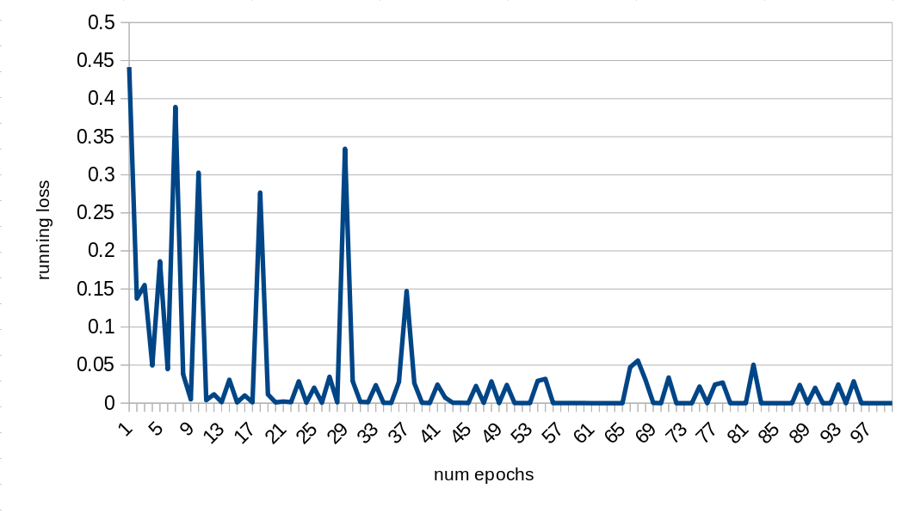
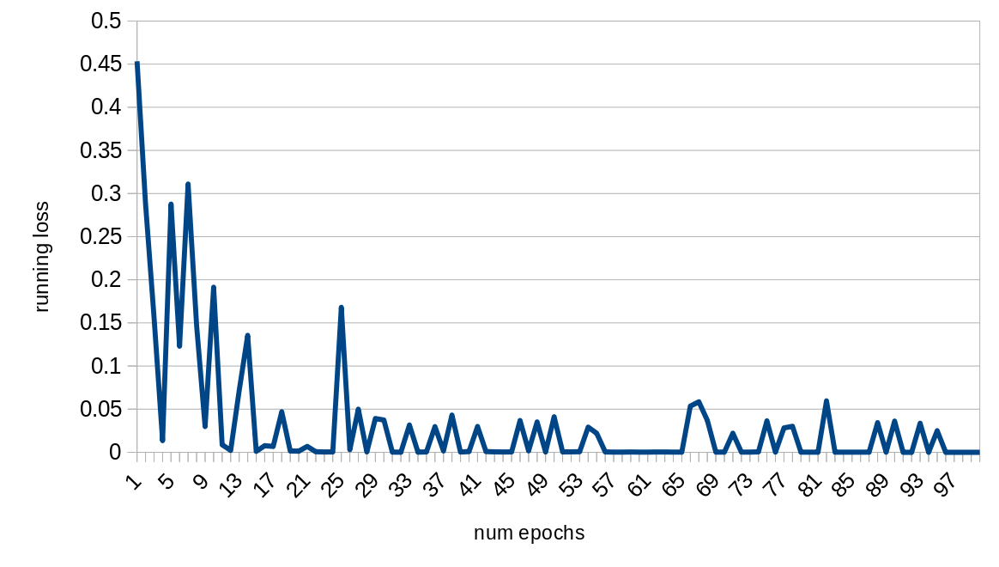

<!-- tex script for md -->

# 週次報告書 2021年12月23日
AL18036 片岡 凪

## 1. 今回の報告会までに実施する予定だったこと
- 分類
    - IBMのデータセットの重複データを削除
    - Epoc数の変更と分析
    - 修正
<!-- - 訓練と評価でバッチサイズが逆になっていた -->
- 論文執筆

## 2. 実施内容

### 目次
- 2.1 IBMのデータセットの重複データを削除し分類・評価
- 2.2 
- 2.3 

### 2.1 

図. 

 
 

### 2.2 

### 2.3 

卒アル日程の催促

## 3. 次回までに実施予定であること
- 1行複数文を1行1文に（前回）
    - claim: 2294->2294
    - evidence: 4692->8492
- IBMのデータセットの重複データを削除
    - claim: 2294->2169
    - evidence: 8492->4209
        - 4209/2169=1.940525587825492
        - 2169/4209=0.5153243050605845
    - 訓練用の8割
        - claim:1745
        - evidence:3358

## 4. メモ
- 再度分類
    - 1epochs
        - {'mcc': 0.7944417638745958, 'tp': 375, 'tn': 782, 'fp': 69, 'fn': 49, 'auroc': 0.960157860896171, 'auprc': 0.9017962485785235, 'eval_loss': 0.3204904726102541, 'acc': 0.9074509803921569}
    - 3epochs
        - {'mcc': 0.806835307373284, 'tp': 379, 'tn': 785, 'fp': 66, 'fn': 45, 'auroc': 0.9670628893865152, 'auprc': 0.9126756504394262, 'eval_loss': 0.3452812945661208, 'acc': 0.9129411764705883}
    - 10epochs
        - {'mcc': 0.8123274793289942, 'tp': 376, 'tn': 792, 'fp': 59, 'fn': 48, 'auroc': 0.9662162162162162, 'auprc': 0.9182158554788243, 'eval_loss': 0.4825559481545497, 'acc': 0.9160784313725491}
    - 20epochs
        - {'mcc': 0.7862791673066413, 'tp': 356, 'tn': 799, 'fp': 52, 'fn': 68, 'auroc': 0.9561933241691241, 'auprc': 0.9010088823741749, 'eval_loss': 0.5092851331568908}
    - 500-epoc
        - {'mcc': 0.0, 'tp': 424, 'tn': 0, 'fp': 851, 'fn': 0, 'auroc': 0.5864244063587787, 'auprc': 0.46602655199618526, 'eval_loss': 0.8520551646128297, 'acc': 0.3325490196078431}
        - Cばかり
        - 638バッチ*500epochs
        - 7時間
        - 988.1GB
        - グラフ作っても収束しているようには見えない
            - 
            - 1万エポック
        - imbarranced weight
    - Running_loss
- やっぱwandb使いたい
    - signal only works in main thread
        - venv？
            - deactivateしても駄目だった
        - VPN？
- 報告書の振り返り
    - ミニバッチのサイズ
        - デフォルトではevalもtrainも8
- loss
    - 強化学習では1000はざら
    - 収束していない
    - うまくいけばe-6くらいになる
- BERTの転移学習がうまくいくかの確認
    - 他のBERT利用チュートリアル
- SimpleTransformers
    - チュートリアルと同様に動くか
    - 1文抜けていないか
- 20epochsで5-10分は長すぎないか
- 転移学習がわかっていない
    - robertaとその先のnnとでどこを更新
    - simpletransformerのリファレンスかGithubを見ないとわからない
    - 最悪robertaと独自のnnで分類する
    - よくわからないものを使うのは怖い
- 相談会後のご助言
    - 分類のtutorialが上手く動くか実装
        - 独自の実装と全く同じ様に動作
        - https://simpletransformers.ai/docs/multi-class-classification/
    - modelのコードの確認
        - simpletransformerのroberta_model.py
            - https://github.com/ThilinaRajapakse/simpletransformers/blob/master/simpletransformers/classification/transformer_models/roberta_model.py
            - lossは交差エントロピー
                - 分類問題によく使われる
                - https://manareki.com/crossentropy_lossfunction
            - self.classifier = RobertaClassificationHead(config)
                - RobertaClassificationHeadクラス
                    - https://huggingface.co/transformers/v1.1.0/_modules/pytorch_transformers/modeling_roberta.html
    - imbalance data用にweightの調節、実行
        - https://simpletransformers.ai/docs/classification-models/#setting-class-weights
        - https://uribo.github.io/dpp-cookbook/slides/class-imbalance#7
            - ダウンサンプリング？
            - アップサンプリング？
            - SMOTE？
        - weight=[1, 1]
            - 1epoch
                - EVIDENCE_LABEL = 0
                - CLAIMS_LABEL = 1
                - {'mcc': 0.7944417638745958, 'tp': 375, 'tn': 782, 'fp': 69, 'fn': 49, 'auroc': 0.960157860896171, 'auprc': 0.9017962485785235, 'eval_loss': 0.3204904726102541, 'acc': 0.9074509803921569}
        - weight=[claims_per_evidence, 1]
            - 恐らく正しい方
            - 1epoch
                - {'mcc': 0.7874351023736239, 'tp': 381, 'tn': 770, 'fp': 81, 'fn': 43, 'auroc': 0.9653321286832361, 'auprc': 0.9205336485153539, 'eval_loss': 0.33354508161501145, 'acc': 0.9027450980392157}
                - 精度が下がった？
            - 100epochs
                - {'mcc': 0.7745904241435616, 'tp': 372, 'tn': 773, 'fp': 78, 'fn': 52, 'auroc': 0.9547300068731569, 'auprc': 0.8934041090260879, 'eval_loss': 0.5367434493706241, 'acc': 0.8980392156862745}
                - 91epochs-0.0044で収束？
                - 98epochs-0.0026で収束？
                    - 89-0.0103
                    - 90-0.0069
                    - 91-0.0044
                    - 92-0.0047
                    - 93-0.0035
                    - 94-0.0032
                    - 98-0.0036
                    - 95-0.0036
                    - 96-0.0060
                    - 97-0.0039
                    - 98-0.0015
                    - 99-0.0027
                - 
                - Eばかり、外れのC2つ
        - weight=[1, claims_per_evidence]
            - 1epoch
                - {'mcc': 0.8090818650539792, 'tp': 381, 'tn': 784, 'fp': 67, 'fn': 43, 'auroc': 0.9686523069418886, 'auprc': 0.9198494619418969, 'eval_loss': 0.25367310275541965, 'acc': 0.9137254901960784}
                - 精度が上がった？
            - 100epochs
                - {'mcc': 0.8042451446917249, 'tp': 370, 'tn': 794, 'fp': 57, 'fn': 54, 'auroc': 0.9465127042547059, 'auprc': 0.8638426793846682, 'eval_loss': 0.46383680540166095, 'acc': 0.9129411764705883}
                - 62epochs-0.0011lossで収束していそう
                    - 59-0.0075
                    - 60-0.0099
                    - 61-0.0139
                    - 62-0.0011
                    - 36-0.0034
                    - その後上がったり下がったり
                - 
                - Eばかり、C1つ
            - 62epochs
                - {'mcc': 0.8053047132851614, 'tp': 374, 'tn': 790, 'fp': 61, 'fn': 50, 'auroc': 0.9365978981442477, 'auprc': 0.845492301108545, 'eval_loss': 0.4510218167510175, 'acc': 0.9129411764705883}
                - ほぼE、C１つ
            - 4epochs
            - 13epochs
        - バッチサイズ 1/10
    - transformer分類器でnnだけ学習する手法が適切かどうか
    - FFNNを分割して実装
- simpletransformersの引数を確認
    - https://simpletransformers.ai/docs/usage/
        - use_early_stopping = True
            - https://qiita.com/simonritchie/items/784e5a67666067dc4af7
            - ストップせず
            - 本当に変な学習を始めないと止まらないのかも
            - patience=3前後でやってみる？
        - best_model_dir
    - https://simpletransformers.ai/docs/classification-models/#setting-class-weights
- debug_numを増やして様子を見る
- LaTeXテンプレートのコンパイル
    - https://qiita.com/willow-micro/items/6b13e2038d628c33be8e
- 目次を編集
    - 交差エントロピーの追記
- 論文執筆
- weightのソースコード
    - ClassificationModel
        - メンバに代入するのみ
        - https://github.com/ThilinaRajapakse/simpletransformers/blob/master/simpletransformers/classification/classification_model.py
    - roberta_model
        - CrossEntropyLossに入れている
        - https://github.com/ThilinaRajapakse/simpletransformers/blob/master/simpletransformers/classification/transformer_models/roberta_model.py
    - from torch.nn import CrossEntropyLoss
        - targetを設定して順番を決める？
            - https://teratail.com/questions/341726
            - num_epochsで
            - ぱっとわからなかったので後回し
- 3記事x3カ国見られるようにした
    - 160記事
- グラフの特徴的なエポックで評価
    - 4エポック
        - {'mcc': 0.8035667589080978, 'tp': 383, 'tn': 778, 'fp': 73, 'fn': 41, 'auroc': 0.9658587011950424, 'auprc': 0.9082390969598422, 'eval_loss': 0.35128727730843823, 'acc': 0.9105882352941177}
        - cは160記事中7個
            - インドは全くない
        - あとで評価
    - 13エポック
        - {'mcc': 0.7928674925433208, 'tp': 370, 'tn': 787, 'fp': 64, 'fn': 54, 'auroc': 0.9583162428219851, 'auprc': 0.8990278949199824, 'eval_loss': 0.5645049487325651, 'acc': 0.9074509803921569}
        - cは160記事中5個
            - インドと韓国は全くない
        - あとで評価
- バッチサイズの調整
    - 今まではデフォルト
        - train_batch_size 8文
            - 638バッチ
        - eval_batch_size 8文
            - 160バッチ
    - 10バッチ100エポック
        - RuntimeError: CUDA out of memory. Tried to allocate 384.00 MiB (GPU 0; 7.79 GiB total capacity; 5.97 GiB already allocated; 36.00 MiB free; 6.00 GiB reserved in total by PyTorch)
    - 16バッチ100エポック
        - RuntimeError: CUDA out of memory. Tried to allocate 240.00 MiB (GPU 0; 7.79 GiB total capacity; 5.69 GiB already allocated; 71.06 MiB free; 5.97 GiB reserved in total by PyTorch)
    - 32バッチ100エポック
        - RuntimeError: CUDA out of memory. Tried to allocate 240.00 MiB (GPU 0; 7.79 GiB total capacity; 5.76 GiB already allocated; 203.94 MiB free; 5.84 GiB reserved in total by PyTorch)
    - 64バッチ100エポック
        - RuntimeError: CUDA out of memory. Tried to allocate 120.00 MiB (GPU 0; 7.79 GiB total capacity; 6.00 GiB already allocated; 17.31 MiB free; 6.02 GiB reserved in total by PyTorch)
    - 128バッチ100エポック
        - train_num 5103文
        - eval_num 1275文
        - train_batch_size 40文
        - eval_batch_size 10文
        - weight=[1, claims_per_evidence]
            - {'mcc': 0.8155391227971583, 'tp': 386, 'tn': 782, 'fp': 69, 'fn': 38, 'auroc': 0.960870119504246, 'auprc': 0.9106979966867893, 'eval_loss': 0.8653483360831373, 'acc': 0.9160784313725491}
            - 収束が早くなり、振動も減っている
            - 収束しそうな点で再学習する予定
            - 
        - weight=[claims_per_evidence, 1]
            - {'mcc': 0.7946893607766448, 'tp': 380, 'tn': 776, 'fp': 75, 'fn': 44, 'auroc': 0.9557277232113163, 'auprc': 0.905232419932518, 'eval_loss': 0.9521337962378738, 'acc': 0.9066666666666666}
            - 収束が早くなり、振動も減っている
            - 収束しそうな点で再学習する予定
            - 
    - 少ないバッチ数でGPUのメモリ不足となるため、やはりFFNNのみの実装を視野に入れるべき...？
        - でも振動少なくなってるし良いかも
        - 再学習と評価をしてから検討
- Running Lossの見方
    - 最後のエポックのlossを表示しているにすぎない
    - 頻度を考慮して平均を取るべきか
- 自分の分類基準を明確に決定するか、論文の分類基準を使うかを決める
    - どちらにせよ論文の分類基準での評価は必要
        - モデルがうまく学習できているかのチェック
- epoch数が少ないほどeval_lossは小さい
    - 1エポックで0.3->どんどん1に近く
    - running lossではなくeval_lossを見るべきか
    - running lossはtrain_lossと同義か微妙
