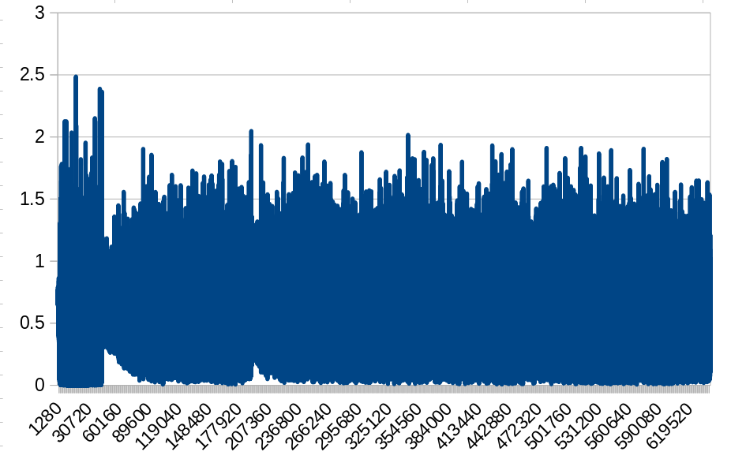
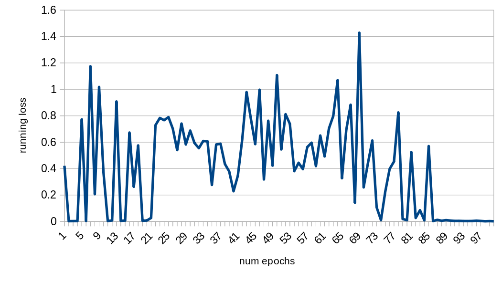
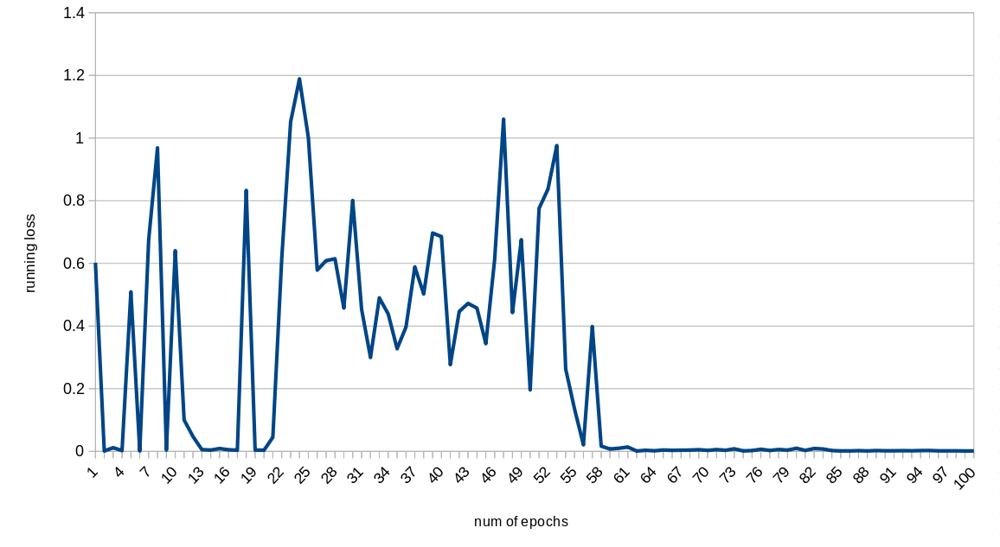

<!-- tex script for md -->

# 週次報告書 2021年12月23日
AL18036 片岡 凪

## 1. 今回の報告会までに実施する予定だったこと
- 分類
    - IBMのデータセットの重複データを削除
    - Epoc数の変更と分析
- クラスタリングの実装
    - 出来事の文章の特徴量ベクトルを作成
    - 主張の文の特徴量ベクトルを作成
    - 3カ国の記事を結合して保存
    - [e-feature-array]を基に記事（行）をクラスタリング
    - 出来事の記事クラスタからnation-name;article-n;sentence-nで記事を特定
    - 指定した記事クラスタファイルの文を、cの[feature-array]でクラスタリング
    - 主張の文クラスタからnation-name;article-n;sentence-nで文とそのクラスタを特定
- 訓練と評価でバッチサイズが逆になっていた
- 論文執筆
- 評価方法の検討

## 2. 実施内容

### 目次
- 2.1 
- 2.2 
- 2.3 

### 2.1 

図. 

 
 

### 2.2 

### 2.3 

卒アル日程の催促

## 3. 次回までに実施予定であること
- 1行複数文を1行1文に（前回）
    - claim: 2294->2294
    - evidence: 4692->8492
- IBMのデータセットの重複データを削除
    - claim: 2294->2169
    - evidence: 8492->4209
        - 4209/2169=1.940525587825492
        - 2169/4209=0.5153243050605845
    - 訓練用の8割
        - claim:1745
        - evidence:3358

## 4. メモ
- 再度分類
    - 1epochs
        - {'mcc': 0.7944417638745958, 'tp': 375, 'tn': 782, 'fp': 69, 'fn': 49, 'auroc': 0.960157860896171, 'auprc': 0.9017962485785235, 'eval_loss': 0.3204904726102541, 'acc': 0.9074509803921569}
    - 3epochs
        - {'mcc': 0.806835307373284, 'tp': 379, 'tn': 785, 'fp': 66, 'fn': 45, 'auroc': 0.9670628893865152, 'auprc': 0.9126756504394262, 'eval_loss': 0.3452812945661208, 'acc': 0.9129411764705883}
    - 10epochs
        - {'mcc': 0.8123274793289942, 'tp': 376, 'tn': 792, 'fp': 59, 'fn': 48, 'auroc': 0.9662162162162162, 'auprc': 0.9182158554788243, 'eval_loss': 0.4825559481545497, 'acc': 0.9160784313725491}
    - 20epochs
        - {'mcc': 0.7862791673066413, 'tp': 356, 'tn': 799, 'fp': 52, 'fn': 68, 'auroc': 0.9561933241691241, 'auprc': 0.9010088823741749, 'eval_loss': 0.5092851331568908}
    - 500-epoc
        - {'mcc': 0.0, 'tp': 424, 'tn': 0, 'fp': 851, 'fn': 0, 'auroc': 0.5864244063587787, 'auprc': 0.46602655199618526, 'eval_loss': 0.8520551646128297, 'acc': 0.3325490196078431}
        - Cばかり
        - 638バッチ*500epochs
        - 7時間
        - 988.1GB
        - グラフ作っても収束しているようには見えない
            - 
            - 1万エポック
        - imbarranced weight
    - Running_loss
- やっぱwandb使いたい
    - signal only works in main thread
        - venv？
            - deactivateしても駄目だった
        - VPN？
- 報告書の振り返り
    - ミニバッチのサイズ
        - デフォルトではevalもtrainも8
- loss
    - 強化学習では1000はざら
    - 収束していない
    - うまくいけばe-6くらいになる
- BERTの転移学習がうまくいくかの確認
    - 他のBERT利用チュートリアル
- SimpleTransformers
    - チュートリアルと同様に動くか
    - 1文抜けていないか
- 20epochsで5-10分は長すぎないか
- 転移学習がわかっていない
    - robertaとその先のnnとでどこを更新
    - simpletransformerのリファレンスかGithubを見ないとわからない
    - 最悪robertaと独自のnnで分類する
    - よくわからないものを使うのは怖い
- 相談会後のご助言
    - 分類のtutorialが上手く動くか実装
        - 独自の実装と全く同じ様に動作
        - https://simpletransformers.ai/docs/multi-class-classification/
    - modelのコードの確認
        - simpletransformerのroberta_model.py
            - https://github.com/ThilinaRajapakse/simpletransformers/blob/master/simpletransformers/classification/transformer_models/roberta_model.py
            - lossは交差エントロピー
                - 分類問題によく使われる
                - https://manareki.com/crossentropy_lossfunction
            - self.classifier = RobertaClassificationHead(config)
                - RobertaClassificationHeadクラス
                    - https://huggingface.co/transformers/v1.1.0/_modules/pytorch_transformers/modeling_roberta.html
                    - 
    - imbalance data用にweightの調節、実行
        - https://simpletransformers.ai/docs/classification-models/#setting-class-weights
        - https://uribo.github.io/dpp-cookbook/slides/class-imbalance#7
            - ダウンサンプリング？
            - アップサンプリング？
            - SMOTE？
        - weight=[1, 1]
            - 1epoch
                - EVIDENCE_LABEL = 0
                - CLAIMS_LABEL = 1
                - {'mcc': 0.7944417638745958, 'tp': 375, 'tn': 782, 'fp': 69, 'fn': 49, 'auroc': 0.960157860896171, 'auprc': 0.9017962485785235, 'eval_loss': 0.3204904726102541, 'acc': 0.9074509803921569}
        - weight=[claims_per_evidence, 1]
            - 恐らく正しい方
            - 1epoch
                - {'mcc': 0.7874351023736239, 'tp': 381, 'tn': 770, 'fp': 81, 'fn': 43, 'auroc': 0.9653321286832361, 'auprc': 0.9205336485153539, 'eval_loss': 0.33354508161501145, 'acc': 0.9027450980392157}
                - 精度が下がった？
            - 100epochs
                - {'mcc': 0.7745904241435616, 'tp': 372, 'tn': 773, 'fp': 78, 'fn': 52, 'auroc': 0.9547300068731569, 'auprc': 0.8934041090260879, 'eval_loss': 0.5367434493706241, 'acc': 0.8980392156862745}
                - 91epochs-0.0044で収束？
                - 98epochs-0.0026で収束？
                    - 89-0.0103
                    - 90-0.0069
                    - 91-0.0044
                    - 92-0.0047
                    - 93-0.0035
                    - 94-0.0032
                    - 98-0.0036
                    - 95-0.0036
                    - 96-0.0060
                    - 97-0.0039
                    - 98-0.0015
                    - 99-0.0027
                - 
                - Eばかり、外れのC2つ
        - weight=[1, claims_per_evidence]
            - 1epoch
                - {'mcc': 0.8090818650539792, 'tp': 381, 'tn': 784, 'fp': 67, 'fn': 43, 'auroc': 0.9686523069418886, 'auprc': 0.9198494619418969, 'eval_loss': 0.25367310275541965, 'acc': 0.9137254901960784}
                - 精度が上がった？
            - 100epochs
                - {'mcc': 0.8042451446917249, 'tp': 370, 'tn': 794, 'fp': 57, 'fn': 54, 'auroc': 0.9465127042547059, 'auprc': 0.8638426793846682, 'eval_loss': 0.46383680540166095, 'acc': 0.9129411764705883}
                - 62epochs-0.0011lossで収束していそう
                    - 59-0.0075
                    - 60-0.0099
                    - 61-0.0139
                    - 62-0.0011
                    - 36-0.0034
                    - その後上がったり下がったり
                - 
                - Eばかり、C1つ
            - 62epochs
                - {'mcc': 0.8053047132851614, 'tp': 374, 'tn': 790, 'fp': 61, 'fn': 50, 'auroc': 0.9365978981442477, 'auprc': 0.845492301108545, 'eval_loss': 0.4510218167510175, 'acc': 0.9129411764705883}
                - ほぼE、C１つ
    - transformer分類器でnnだけ学習する手法が適切かどうか
    - FFNNを分割して実装
- simpletransformersの引数を確認
    - https://simpletransformers.ai/docs/usage/
        - use_early_stopping = True
            - https://qiita.com/simonritchie/items/784e5a67666067dc4af7
            - ストップせず
            - 本当に変な学習を始めないと止まらないのかも
            - patience=3前後でやってみる？
        - best_model_dir
    - https://simpletransformers.ai/docs/classification-models/#setting-class-weights
- debug_numを増やして様子を見る
- LaTeXテンプレートのコンパイル
    - https://qiita.com/willow-micro/items/6b13e2038d628c33be8e
- 目次を編集
    - 交差エントロピーの追記
- 論文執筆

1.  目次
2.  序論
    1.  研究背景
    2.  研究目的
    3.  本論文の構成
3.  本研究で用いる知識・技術
    1.  ニュース推薦システム
    2.  ニュース推薦システムが生むバイアス
        1.  エコーチェンバー問題
        2.  フィルターバブル問題
    3.  機械学習
        1.  ニューラルネットワーク
        2.  教師あり学習
        3.  Attention（LSTMに触れる）
        4.  Transformer（教師あり分類にも触れる）
        5.  BERT
        6.  RoBERTa（BERTとの比較など）
    4.  文章分類
        1.  テキストの前処理
        2.  単語埋め込み
        3.  Transformer分類器
        4.  分類モデルの評価（acc, prcなどの議論）
    5.  文章の類似度の算出
        1.  Sentence-BERT
        2.  コサイン類似度
    6.  クラスタリング
        1.  非階層クラスタリング
        2.  階層的クラスタリング
        3.  Ward法 
        4.  （その他使用した手法）
        5.  t-SNE (使うかも)
4.  関連研究
    1.  ニュース推薦システムのバイアスの解決
        1.  Breaking the filter bubble: democracy and design
            1.  （UIでバブルの可視化）（結局表示されるものにバイアスがかかる、行動に繋がらない）
            2.  （トピックモデル、LSI, LDAの議論）
    2.  話題の定量化によるニュース推薦手法
        1.  トピックマップ
        2.  Labeled Bilingual Topic Model for Cross-Lingual Text Classification and Label Recommendation
            1.  （LDAの利用）
        <!-- 2.  LSI -->
    1.  （要追加調査：比較評価できる推薦手法）（出来事、主張に着目するシステムなど）
        1.  Investigating COVID-19 News Across Four Nations A Topic Modeling and Sentiment Analysis Approach
            1.  トピックモデル、top2vec, roberta
    <!-- 6.  tf-idf -->
    <!-- SCDV -->
5.  提案手法
    1.  使用する語彙と基準の定義
        1.  文と文章
        2.  出来事の文
        3.  主張の文
        4.  文が示す話題の類似度
    2.  記事の出来事と主張のクラスタを用いた多言語ニュース推薦
        1.  手法概要
        2.  クラスタリングの順序の検討
    3.  学習データの前処理
    4.  記事データの前処理
6.  実装
    1.  システムの設計指針（入出力、使い方など）
    2.  システム構成（モジュールの説明）
    3.  実装環境（PCスペック、ライブラリバージョンなど）
    4.  データの前処理
        1. 自然言語処理のためのテキストの前処理（前処理の種類、なぜ前処理するのか、awkの正規表現などの議論）
        2. 省略のピリオドに注意した文章の分割（Stanza, spacyの議論）
    5.  出来事の文と主張の文の分類
        1. Simple Transformers
    6.  出来事の文章のクラスタリング
        1.  (要検討)
    7.  主張の文のクラスタリング
        1.  (要検討)
7.  実験
    1.  データセットの選定
        1.  出来事の文と主張の文の分類器の学習データ（IBM Debater Datasetの議論）
        2.  分類とクラスタリングを行うデータ（covid-19-articlesの議論）
            <!-- 1.  Japanese fakenews dataset -->
    2.  出来事の文と主張の文の分類
        1.  実験方法
        2.  実験結果
        3.  （試行錯誤）
    3.  出来事の文章のクラスタリング
        1.  実験方法
        2.  実験結果
        3.  （試行錯誤）
    4.  主張の文のクラスタリング
        1.  実験方法（クラスタの階層の基準ごとの評価）
        2.  実験結果
        3.  （試行錯誤）
    5.  （他の研究との比較実験）
        1.  実験方法
        2.  実験結果
        3.  （試行錯誤）
8.  結果と考察
    1.  既存手法との比較
    2.  提案手法の妥当性
        1.  入力と出力の妥当性
        2.  処理速度の妥当性（分散システムの議論も）
    3.  （結果を基に検討）
9.  まとめと展望
    1.  まとめ
    2.  今後の展望
    3.  （結果を基に検討）
    4.  データセットの相性（ディベートとニュース）
10. 謝辞
11. 参考文献
