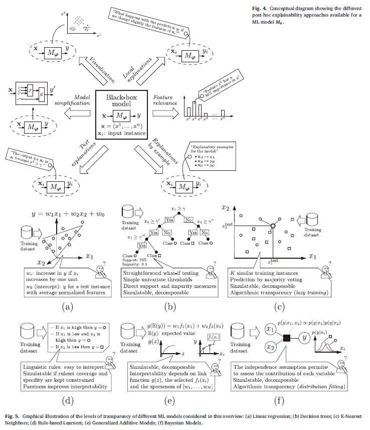
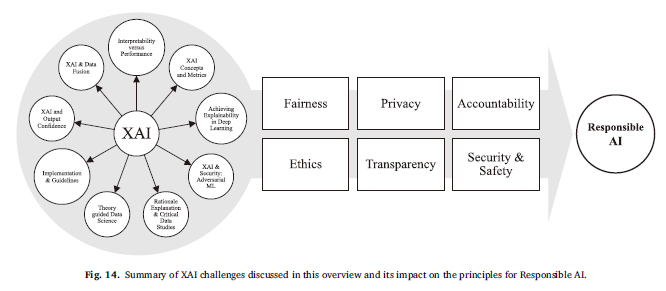
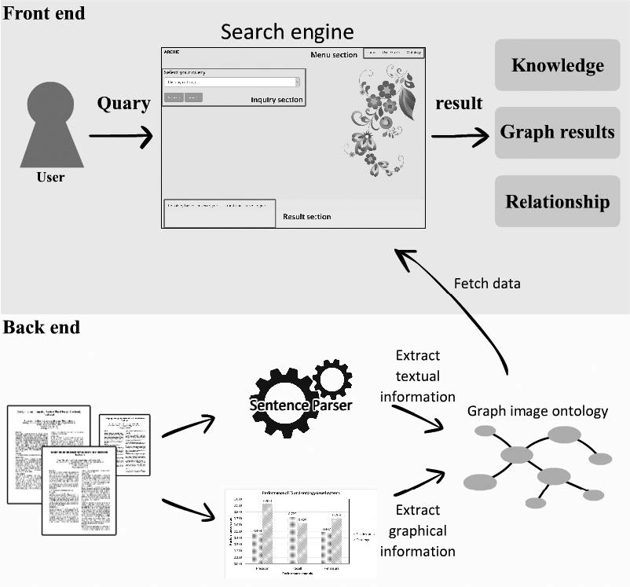

# 論文調査記録 2021年03月22日
AL18036 片岡 凪  
XAI，オントロジーベースの検索エンジン

## 論文1. [Explainable Artificial Intelligence (XAI): Concepts, taxonomies, opportunities and challenges toward responsible AI](https://www.sciencedirect.com/science/article/pii/S1566253519308103)

- タイトル和訳
    - Explainable Artificial Intelligence (XAI): Responsible AIの概念，分類，機会と課題
- 著者
    - Alejandro Barredo Arrieta, Natalia Díaz-Rodríguez, Javier Del Ser, Adrien Bennetot, Siham Tabik, Alberto Barbado, Salvador Garcia, Sergio Gil-Lopez, Daniel Molina, Richard Benjamins, Raja Chatila, Francisco Herｓrera
- 掲載論文誌等
    - Information Fusion,
Volume 58,
2020,
Pages 82-115,
ISSN 1566-2535

### 1. どんなもの？
XAIに類する技術の貢献や文献を検証し，課題を設定し，XAIの定義を行う論文．XAIとは，機械学習における説明可能性を確立する技術を指す．

### 2. 先行研究と比べてどこがすごい？
データフュージョンと説明可能性に分岐点が存在する．  
（すごさの明記は概要になし）

### 3. 技術や手法のキモはどこ？
Responsible AI*1 の公正さ，モデルの説明可能性，説明責任を核として，実際の組織にAIを大規模に導入するための方法論に繋がる．

  
*1 責任のあるAI  
公平性，信頼性と安全性，プライバシーとセキュリティ，包括性（あらゆる人々にメリット），透明性，アカウンタビリティ（説明責任）をもつAI
Microsoft の AI の基本原則

*2 データフュージョン  
複数のデータを単一のデータに融合する技術．購買データと広告接触データから単一種類の対象者を絞り込むためなどに応用．共通の変数を統計的に統合．  
[インテック（2014）「データフュージョン技術を用いたデータ活用ソリューション」](https://www.google.com/url?sa=t&rct=j&q=&esrc=s&source=web&cd=&ved=2ahUKEwj9iOSW3sLvAhVByosBHdzmD78QFjACegQIBhAD&url=https%3A%2F%2Fwww.intec.co.jp%2Fcompany%2Fitj%2Fitj15%2Fcontents%2Fitj15_22-29.pdf&usg=AOvVaw3jMzP_Z_u8vA-L2omEjRHI)

### 4. どうやって有効だと検証した？
概要に記載なし．

### 5. 議論はある？
論文の目標として，XAIの新規参入者にXAIの完全な分類法を提供し，また他分野の専門家が，AIの解釈可能性の欠如に対する偏見なしに，それぞれの活動分野でAIの利点を受け入れることを奨励させたい．

### 6. 次に読むべき論文は？
Responsible AIやデータフュージョンに関する論文
  
[Roger Clarke,
Principles and business processes for responsible AI,
Computer Law & Security Review,
Volume 35, Issue 4,
2019,
Pages 410-422](https://www.sciencedirect.com/science/article/pii/S026736491930127X)
  
[Schiff, D., Rakova, B., Ayesh, A., Fanti, A., & Lennon, M. (2020). Principles to Practices for Responsible AI: Closing the Gap. **ArXiv**, abs/2006.04707.](https://www.semanticscholar.org/paper/Principles-to-Practices-for-Responsible-AI%3A-Closing-Schiff-Rakova/973b72984abceec59d1a97622b1a34946a9d89ef)  
  
[D. L. Hall and J. Llinas, "An introduction to multisensor data fusion," in Proceedings of the IEEE, vol. 85, no. 1, pp. 6-23, Jan. 1997, doi: 10.1109/5.554205.](https://ieeexplore.ieee.org/abstract/document/554205)

## 論文2. [Semantic-Based Search Engine System for Graph Images in Academic Literatures by Use of Semantic Relationships](https://shibaura.pure.elsevier.com/ja/publications/semantic-based-search-engine-system-for-graph-images-in-academic--2)
- タイトル和訳
    - 意味関係を用いた学術文献上の画像のための意味ベースの検索エンジンシステム
- 著者
    - Sarunya Kanjanawattana, Masaomi Kimura
- 掲載論文誌等
    - International Journal of Machine Learning and Computing, Vol. 9, No. 6, December 2019

### 1. どんなもの？
インターネット上の膨大なデータから，検索対象のデータのみならず，検索対象に関連する新しい知識を提供してくれる検索エンジンシステムの提案．学術論文に絞って研究を行っている．  
  
手法としては，論文の新しい知識としてグラフ画像の画像情報とテキスト情報を抽出し，これをオントロジーに格納している*3．また，このオントロジーに適用可能な検索エンジンシステムを構築している．

*3 オントロジー  
対象を表現するための概念と，概念間の関係を規定するもの．知識表現．  
[日本大百科全書（ニッポニカ）2019](https://japanknowledge.com/lib/link/?lid=1001000330185)
<!-- もともとは哲学の存在論のことだが，最近，ウェブ上の情報の意味を扱い，セマンティックウェブに格上げして人工知能（AI）が扱えるようにしようとする研究分野では，対象を表現するための概念と，概念間の関係を規定するものという意味で使われている．オントロジー工学は，AIの初期から研究されていた知識表現と同じと考えてよい．また，知識表現で問題にされていた，上位概念（たとえば鳥）から下位概念（たとえばワシ／ニワトリ）への属性（たとえば飛ぶこと）の継承／非継承などに関しては，同じ問題が再度議論されている感がある．

　また，問題ドメインごとに異なるオントロジーが構築されていたり，さらには同じドメインであっても組織ごとに異なるオントロジーが使われていたりする例も多く，オントロジー間の翻訳も必要である．たとえば西暦と和暦であったり，同じ魚が別の名前でよばれることがあったりするが，オントロジーはこれらをそのまま反映してつくられていることが多いのでそれらを統一する必要がある． -->

### 2. 先行研究と比べてどこがすごい？
Elasticsearchベースの検索エンジンシステム*4 よりも正確で簡潔な情報を提供することができる．  

*4 Elasticsearch  
ログやシステムメトリック，Webアプリケーションなどのデータをパースして正規化し，エンリッチしてインデックスを張った分散型検索エンジンシステム．オントロジーを使用していない？  
[Elastic社 「Elasticsearchについて」](https://www.elastic.co/jp/what-is/elasticsearch)

### 3. 技術や手法のキモはどこ？
オントロジー内の意味的関係から導き出すことができる知識は多く，有用である．

### 4. どうやって有効だと検証した？
10名の被験者が本システムの検索結果の正確性や関連度の高さを評価した．また，F値を算出し，Elasticsearchベースの検索システムよりも精度が高いことを示した．

### 5. 議論はある？
（オントロジーベースの検索エンジンシステムは社会に受け入れられやすい）

### 6. 次に読むべき論文は？
オントロジーや，オントロジーを応用した検索エンジンシステムに関する論文

[[16] S. Arivazhagan et al., “Ontology-based personalized search and
browsing,” Pattern Recognition Letters, vol. 25, no. 2, pp. 156–161,
Feb. 2003.](https://content.iospress.com/articles/web-intelligence-and-agent-systems-an-international-journal/wia00019)
  
[[21] T. M. Deserno, S. Antani, and R. Long, “Ontology of gaps in contentbased
image retrieval,” Journal of digital imaging, vol. 22, no. 2, pp.
202–215, 2009.](https://link.springer.com/content/pdf/10.1007/s10278-007-9092-x.pdf)
