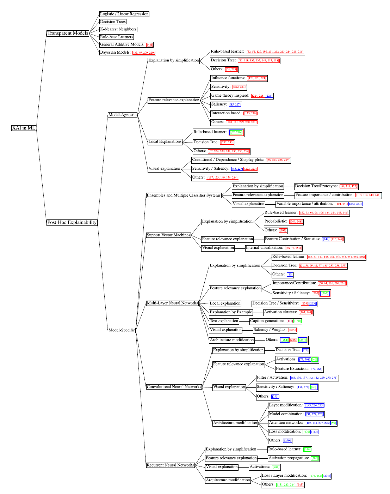
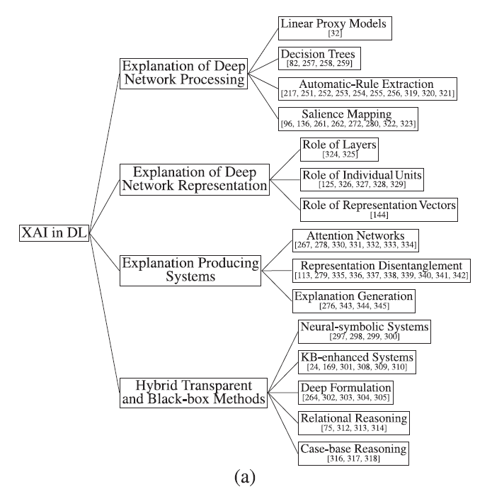

# 論文調査記録 2021年04月05日
AL18036 片岡 凪

## 論文1. [Explainable Artificial Intelligence (XAI): Concepts, taxonomies, opportunities and challenges toward responsible AI](https://www.sciencedirect.com/science/article/pii/S1566253519308103)

- タイトル和訳
    - Explainable Artificial Intelligence (XAI): Responsible AIの概念，分類，機会と課題
- 著者
    - Alejandro Barredo Arrieta, Natalia Díaz-Rodríguez, Javier Del Ser, Adrien Bennetot, Siham Tabik, Alberto Barbado, Salvador Garcia, Sergio Gil-Lopez, Daniel Molina, Richard Benjamins, Raja Chatila, Francisco Herｓrera
- 掲載論文誌等
    - Information Fusion,
Volume 58,
2020,
Pages 82-115,
ISSN 1566-2535

### 1.どんなもの？
AIモデルの内部機能を説明するXAIについて、400の研究をまとめた論文。  
論文では、以下の6つが紹介されている。  

1. XAIの定義と目的
2. 各MLの透明度の紹介
3. XAIの2つの分類
    - 説明力によるいくつかの分類
    - DLごとのいくつかの分類
4. XAIのニーズと課題
5. XAIの実用化に必要な要素
6. XAIの利点とリスク

### 2.先行研究と比べてどこがすごい？
従来のAIにない以下の目的を達成することができる
- 信頼性
    - モデルは意図通りに調節可能か
- 因果関係
    - 変数間の因果関係
- 転送可能性
    - 連続するモデルの境界の説明
- 有益性
    - 意思決定のサポート
- 自信
    - 制御可能な安定性
- 公平性
    - 可視化で扱いやすく
    - データのバイアスを強調
- アクセシビリティ
    - MLの改善に繋がる
- インタラクティビティ
    - 対話可能にする微調整
- プライバシーへの気付き
    - 何が入力になっているかが不明だとプライバシー侵害に繋がる

### 3.技術や手法のキモはどこ？
以下のMLの分類ごとに手法を変える

- ある程度透明性のあるML
    - 何が透明化できるのかを理解する
    - 何を複雑化すると透明性が落ちるのかを理解する
- 事後XAI
    - モデルに囚われない手法
        - 視覚化
            - 簡略化
            - 特徴の関連性推定
    - モデルの再設計

### 4.どうやって有効だと検証した？
検証は分類されたそれぞれのAIの文献に委ねられている。

### 5.議論はある？
- AI原則
    1. 差別に繋がらない
    2. 5W1Hが説明可能
    3. 持続可能、人類と公益のため
    4. 設計段階のプライバシー
    5. 原則のサードパーティーへの拡張
- データフュージョンでデータのプライバシーを侵害するXAIの可能性
    - プロセスが明確になって改善が進むが
    - ビックデータのプライバシーを暴いてしまう

### 6.次に読むべき論文は？
訓練されたSVMモデルの視覚化に関する論文？
