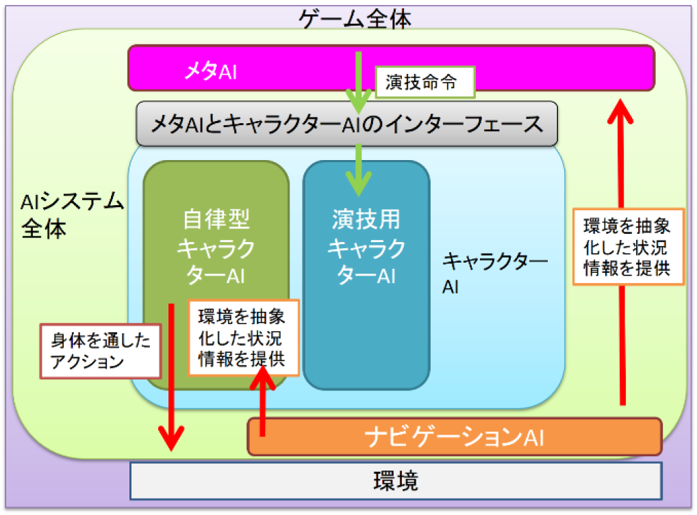
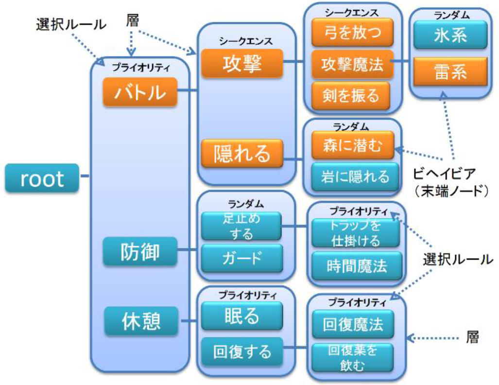
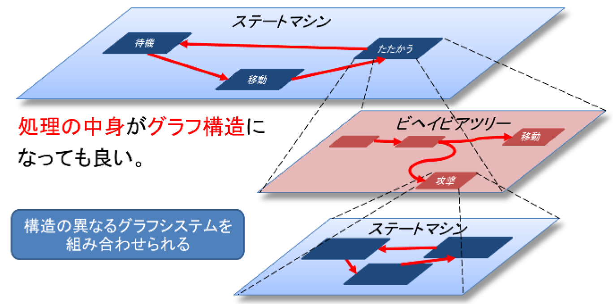

# 論文調査記録 2021年04月12日

AL18036 片岡 凪

## 論文1. 『大規模 デジタルゲームにおける人工知能の一般的体系と実装』
- 著者
    - 三宅陽一郎
- 掲載論文誌等
    - 人工知能学会論文誌, vol. 35, no. 2, p. B-J64_1-16, 2020, doi: 10.1527/tjsai.B-J64.

### 1.どんなもの？
大規模なデジタルゲームにおける種々のAIとその運用方法に関するレビュー論文。MLというより、**人間的に振舞う技術としてのAI**。オープンワールドゲームであるFFXVでの工夫点が述べられている。  

- **メタAI**
    - ゲームの流れを調整する監督
- **ナビゲーションAI**
    - 地形の認識
    - 多少MLの要素を含みそう
- **キャラクターAI**
    - キャラの思考を表現

  
図1 ゲームAIの一般的な構造  

### 2.先行研究と比べてどこがすごい？
AIを役割で分割することで、**膨大な挙動のハードコード**（スクリプテッドAI）**から解放**された。再利用性も向上した。

- メタAI
    - より**自然な挙動**を実現
    - ユーザースキル以上の**多くのデータを参照**
        - キャラ
        - 配置
        - タイミング
        - 地形
        - シナリオ
        - ユーザースキル
- ナビゲーションAI
    - **客観的**
    - **正確**
    - **動的**
        - 省メモリ
        - 省負荷
- キャラクターAI
    - **多様性**
        - 挙動など
    - **拡張性**
    - **カスタマイズ性**

### 3.技術や手法のキモはどこ？
- メタAI
    - 
- ナビゲーションAI
    - A*アルゴリズムによるパス検索
        - 標準
    - ウェイトポイント法
        - 90年代
        - ポイントの近接関係をネットワークグラフに落とす
    - ナビゲーション・メッシュ法
        - 地形を凸多角形で覆う
        - 近接メッシュ同士がリンク
    - コストの最小化
        - ジグザグ
    - ファンネル・アルゴリズム
        - スムージング
    - 近距離のときはレイキャスト
- キャラクターAI
    - **ステートマシンとビヘイビアツリーの入れ子構造**
        - ステートマシン
            - 状態遷移
            - ゲームの状況認識に優れる
        - ビヘイビアツリー
            - 各層に
                - 選択ルール、競合ノード
                - シーケンスルール、プライオリティルール、ランダムルール
            - 連続する行動の生成に優れる
        - （粒度の管理次第で状態が迷子になるのでは？）

  
図2 ビヘイビアツリー  
  
  
図3 ステートマシンとビヘイビアツリーの入れ子構造

### 4.どうやって有効だと検証した？
実際の開発の経験をもとに、多くは**定性的**に述べられている。アートの定量化の難しさも背景にあるものと考える。キャラクターAIはその粒度に配慮し、メモリ消費を20MBに抑えている。

### 5.議論はある？
ステートマシンとビヘイビアツリーを融合した技術は、表形式のデータをコンパクトにできない（詳細情報が乏しい）。解釈：元々コンパクトにできないものを、未解決のまま残している？

### 6.次に読むべき論文は？
本稿とは異なり、MLに近いゲームAI
- 

## 論文2. 機械学習を用いたゲームAIの人間らしい行動に関する研究
- 著者
    - 島根大学 
    - 大輔三浦 邦夫會澤

- 掲載論文誌等
    - 第79回全国大会講演論文集, vol. 2017, no. 1, pp. 473–474, 3月 2017.

### 3.技術や手法のキモはどこ？
- 強化学習のQ学習
    - 報酬
        - ゆらぎ
        - 遅れ
        - 疲れ

## 論文3. Feature space interpretation of **SVMs** with indefinite kernels
- タイトル和訳
    - 不定形カーネルを用いたSVMの特徴空間解釈
- 著者
    - B. Haasdonk 
- 掲載論文誌等
    - IEEE Trans. Pattern Anal. Machine Intell., vol. 27, no. 4, pp. 482–492, 4月 2005, doi: 10.1109/TPAMI.2005.78.

### 1.どんなもの？
- 数学博士の論文で卒論には手に負えなさそう
- 関連語
    - indefinite kernel, pseudo-Euclidean space, separation of convex hulls

