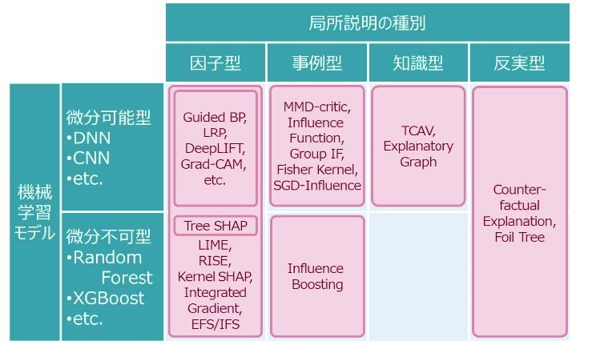

<!-- tex script for md -->

# 論文調査記録 2021年04月19日
AL18036 片岡 凪

## 論文1. 「XAI(eXplainable AI)技術の研究動向」
- 著者
    - 正史恵木
        - 日立製作所中央研究所
        - 北海道大学情報基盤センタースーパーコンピューティング部門脚韻研究員
- 掲載論文誌等
    - 日本セキュリティ・マネジメント学会誌, vol. 34, no. 1, pp. 20–27, 2020, doi: 10.32230/jssmjournal.34.1_20.

### 1.どんなもの？
**XAIのレビュー論文。**XAIを以下のように分類し、その中でも主流であるというShapley値とInfluence Functionについて詳解している。  

- **トランスペアレント型**
    - 過程や構造が解釈可能
- **ブラックボックス型**
    - 過程や構造が解釈困難
        - **局所説明**（アウトカム説明、インスタンス説明）
            - **因子型**
                - 各特徴量をどの程度重視したか
                    - 微分可能
                        - DNN, CNNを逆方向に解析
                    - 微分不可能
                        - LIME
                    - どちらも主観評価
                        - 協力ゲーム理論の**Shapley値**を活用
            - **事例型**
                - 似た特徴量を推測？
                    - Loss関数が微分可能
                        - **Influence Function**
                            - 誤判定を起こした教師データを定量化
            - **知識型**
                - 重視する特徴量が専門家と同じか
            - **反実型**
                - 予測が変わる特徴量はどれか
        - **大域説明**
            - 傾向、有効/無効なケース、差別やバイアスの判断
                - **モデル検査**
                    - 局所説明の統計分析
                - **モデル説明**
                    - 簡易モデルに近似・射影

### 2.先行研究と比べてどこがすごい？
DNN, CNNを逆方向に解析する手法やLIMEは、説明のあるべき姿から導出されていない（LIMEは別の分類器の作成を行っている）ため、**手法の妥当性が主観的**であり、**説明としてどの手法が最も尤もらしいかが明確でなかった。**  

対してShapley値やInfluence Functionは、**モデルを定量的に説明**することができる（→手法同士の比較が可能？）

### 3.技術や手法のキモはどこ？
入力を変えたときの、その入力に対応する出力の変化を定式化している（4.参照）。したがって定量化が可能。  

- **Shapley値**
    - 異なる入力に対する出力の差
        - $f(x)-f\left(x^{\star}\right)=\phi_{1}\left(x, x^{\star}, f\right)+\cdots+\phi_{m}\left(x, x^{\star}, f\right)$
    - への要請
        - 各特徴量の貢献度の差の総和となる
        - 出力の差が起きない2入力の貢献度の差はゼロ
        - 出力の差が等しい2セットの2入力の貢献度の差は等しい
        - 線形結合した予測器の貢献度も線形結合
    - **これらの要件を満たす「各特徴量の出力差への貢献度」**
        - $\phi_{i}\left(x, x^{\star}, f\right)=\sum_{S \subseteq M \backslash\{i\}} a_{S}\left\{f\left(z_{S \cup\{i\}}\right)-f\left(z_{s}\right)\right\}$
        - $a_{S}=\frac{|S| !(m-|S|-1) !}{m !}$
- **Influence Function**
    - 教師データの変化と最適値の変化で同様に定式化
        - $\widehat{\boldsymbol{\theta}}=\operatorname{argmin}_{\boldsymbol{\theta}} \boldsymbol{L}(\boldsymbol{\theta})$
        - $\mathcal{L}(\theta)=\frac{1}{n} \sum_{i}^{n} L\left(z^{(i)} ; \theta\right)$
    - **最適状態から特徴$z^{(k)}$を削った際の予測誤差の差**
        - $I\left(z^{\text {test }}, z^{(k)}\right) \sim-\frac{1}{n} \sum_{i=1}^{p} v_{i}\left(z^{\text {test }}\right) u_{i}\left(z^{(k)}\right)$
        - $v_{i}(z)=\left[\begin{array}{c}
\partial L(z, \theta) \\
\partial \theta_{i}
\end{array}\right]_{\theta=\widehat{\theta}}$
        - $u_i$ は $\sum_{j=1}^{p} u_{j}\left[\begin{array}{l}
\partial^{2} \mathcal{L}(\theta) \\
\partial \theta_{i} \partial \theta_{j}
\end{array}\right]_{\theta=\widehat{\theta}}+v_{i}\left(z^{(k)}\right)=0$ の解

ただし、恐らく2つの手法には次の**弱点**がある（片岡解釈）
- 各特徴量の貢献度$\phi_i$が互いに独立である必要がある
- 1つの特徴量の差分しか見ていないので、局所的最適解にハマる

### 4.どうやって有効だと検証した？
レビュー論文のため、検証は無し。

### 5.議論はある？
AIの一部が説明可能になると、その一部分に関する**悪意のある変更も説明可能になってしまう**ことが多く、セキュリティに留意して研究を行う必要がある。

- 例
    - MNISTで、4に点を加えて9に認識させる
    - クレカの自動審査で、ギリギリ審査に通る境界まで年収を微妙に偽って審査を通す

### 6.次に読むべき論文は？
- Shapley値やInfluence Functionの具体的な応用
- XAI手法の違う導出パターンを見てみたい
- 余裕があれば
    - Shapley値やInfluence Functionが局所的最適解にハマるかを調べたい

## 論文2. 「Doctor XAI: an ontology-based approach to black-box sequential data classification explanations」
- タイトル和訳
    - Doctor XAI: オントロジーベースのブラックボックス逐次データ分類説明へのアプローチ
- 著者
    - C. Panigutti, A. PerottiとD. Pedreschiｓ
- 掲載論文誌等
    - Proceedings of the 2020 Conference on Fairness, Accountability, and Transparency, New York, NY, USA, 1月 2020, pp. 629–639, doi: 10.1145/3351095.3372855.
  
※読みかけ

### 1.どんなもの？
Doctor XAIによって、患者の病歴から、次回の診察時間、診断、薬の順番を予測する技術。  
シーケンシャルデータやオントロジーリンクされたデータの分類に適用できる初めての（ブラックボックスに）依存しないXAI技術  
  
依存しない：agnostic（直訳：不可知論者の＝ものごとの本質は人には認識することが不可能である、とする立場）

### 2.先行研究と比べてどこがすごい？
- 医療オントロジーに存在する意味的な情報を利用することで、説明の質が向上する

### 3.技術や手法のキモはどこ？
- ブラックボックスの局所的な振る舞い・決定境界を訓練
- neighbourhood
    - 説明したいインスタンスxの周辺の合成インスタンスのセット
- 手順
    - neigbourhoodをブラックボックスでラベル付け
    - neigbourhood上で解釈可能なモデルを学習
    - 象徴的なルールを出力

### 4.どうやって有効だと検証した？
260,000人の患者で学習し、recall@30で0.79（上位30個中の正解数 / 総正解数）？
オントロジーの有無で10%性能向上（何の？）

### 5.議論はある？
ブラックボックスに依存しないため、オンラインマーケットバスケット分析など、オントロジー概念に関連する一連のイベントを特定する様々な応用が可能

### 6.次に読むべき論文は？
- オントロジーが結局わからずじまいになっている節がある
- 既知のモデルの説明でなく、既知の手法を用いた複数のモデルの説明をする論文
