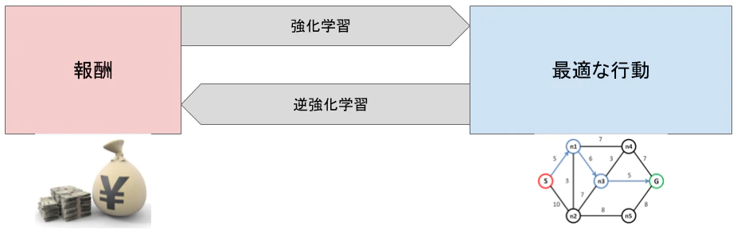
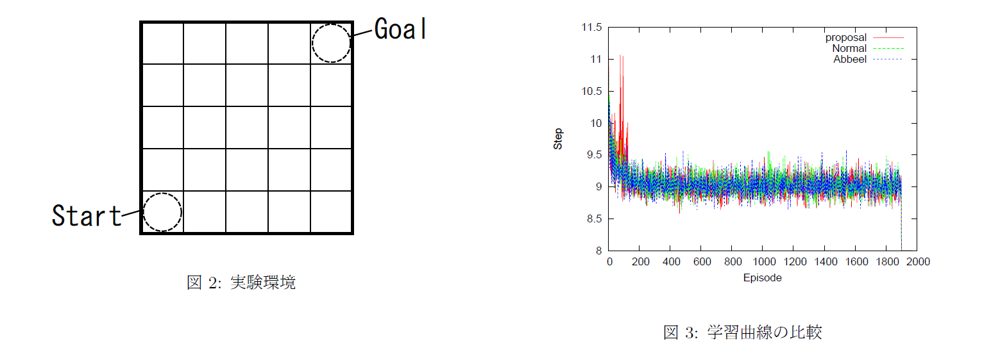

<!-- tex script for md -->

# 論文調査記録 2021年04月26日
AL18036 片岡 凪

## 論文1. 逆強化学習を用いた転移可能な報酬関数の推定
- 著者
    - 勇樹北里
    - 幸代荒井
    - 千葉大学大学院工学研究科都市環境システムコース
- 掲載論文誌等
    - 人工知能学会全国大会論文集, vol. JSAI2016, p. 3D3OS30a2-3D3OS30a2, 2016, doi: 10.11517/pjsai.JSAI2016.0_3D3OS30a2.

### 1.どんなもの？
**転移学習と逆強化学習を組み合わせ、より学習効率の高い報酬関数を推定するシステム。通常の転移学習では元タスクから方策を転移させるが，今回提案した手法では報酬関数を転移させる。**
  
cf.  
- 転移学習
    - 解決が容易なタスクを難しいタスク用に転移
- 逆強化学習
    - エージェント（エキスパート）の行動軌跡と状態遷移確率から報酬関数を推定
    <!-- - 方策ではなく報酬を転移？
        - 方策＝下図の「最適な行動」
        - 逆強化学習⊂転移学習ではないのでは？
        - ~~転移~~ 学習？ -->
  
  
図1 Qiita(2017)「逆強化学習を理解する」より引用

### 2.先行研究と比べてどこがすごい？
**逆強化学習は、元とするエキスパートの行動より高い性能を得ることができない。本研究では、複数のエキスパートとそれを利用した複数の逆強化学習を行い、得た報酬を転移学習することによって、エキスパートの行動より高い性能を目指す。**

### 3.技術や手法のキモはどこ？
1. **強化学習で元タスクを用意**
    - スタート、ゴール、障害物の座標
    - 各迷路の最適方策を求める
    - 最適方策からエキスパートの行動軌跡を求める
2. **Abbeelの逆強化学習による各状態の報酬関数の推定**
3. **NNによる目標タスクへの報酬の転移**
    - 入力は元タスクの環境情報
    - 出力は求めた報酬関数
    - バックプロパゲーション
    - 目標タスクを入力して報酬関数を推定

### 4.どうやって有効だと検証した？
  

- **5*5マスの10個の迷路問題を1000回学習**
    - 5*5*10*1000*(1マスの学習時間)
        - 1マスの学習時間はO(N)と仮定して10^6ループ程度？
        - これ以上は厳しそう
- 障害物はランダムに3-10個
    - ゴールに辿り着けないケースは除外
- 右回りの最短経路のみが学習できた
    - 何をもって学習できたといえるのか？
    - なぜ右回りのみ？
- 100試行の学習曲線の平均値を図示
- **差は出なかった**

### 5.議論はある？
- 差が出ない原因
    - **訓練数不足？**
    - **パラメータの調整不足？**
    - 提案手法の正確な評価
        - 可視化に近似曲線を使えば少しはわかりやすいかも？
    - **学習効率を改善する報酬関数ではなく、完全にエキスパートと一致するものを見つけてしまっているため？**

### 6.次に読むべき論文は？
- 木村研の昨年度の先輩が近い研究をしていた
    - 田植えの経路
- 失敗しない工夫のための技術
    - 転移学習のXAI
    - 逆強化学習のXAI

## 論文2. タイトル
- タイトル和訳
    - 
- 著者
    - 
- 掲載論文誌等
    - 

### 1.どんなもの？

### 2.先行研究と比べてどこがすごい？

### 3.技術や手法のキモはどこ？

### 4.どうやって有効だと検証した？

### 5.議論はある？

### 6.次に読むべき論文は？

