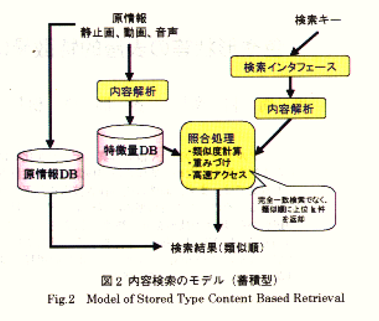
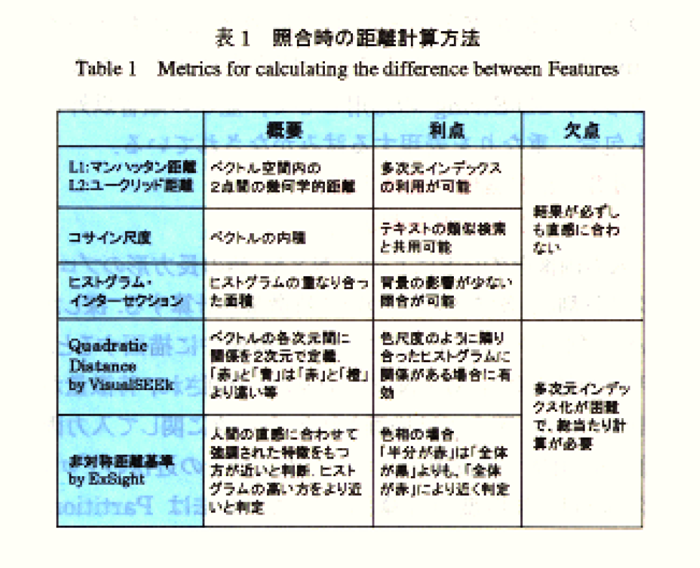
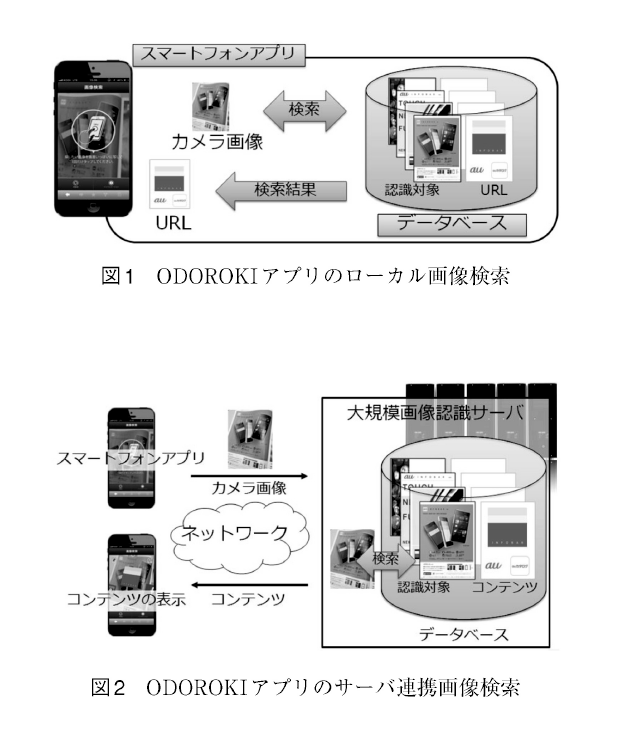

<!-- tex script for md -->

# 論文調査記録 2021年05月10日
AL18036 片岡 凪

## 論文1. 色や形状等の表層的特徴量にもとづく画像内容検索技術
- 著者
    - 和彦串間, 浩樹赤間, 精一紺谷と雅司山室
- 掲載論文誌等
    - 情報処理学会論文誌データベース（TOD）, vol. 40, no. SIG03(TOD1), pp. 171–184, 2月 1999.

### 1.どんなもの？
画像を検索する際に、**画像のどんな特徴を入力キーとするべきか**をまとめた古いレビュー論文。網羅的によくまとまっている。

### 2.先行研究と比べてどこがすごい？
テキストキーワードによる画像検索は、画像に手動でテキストラベルを付与する必要があり、膨大な画像の検索に適さない場合がある。この問題は、テキストキーワードの代わりに画像の特徴を入力キーとすることで解決することができる。

### 3.技術や手法のキモはどこ？
入力データの分類
- タグ情報（テキスト）
    - タイトル
    - 作者
    - 作成日時
- 画像そのもの（内容検索）
    - 逐次処理型
        - 入力画像と完全に一致する画像を検索
    - **蓄積型**
        - **事前に大量の画像から抽出した特徴量を蓄積してインデックスを張り、その大量の画像の中から入力画像（検索キー）と類似したものを検索する**
            - タグ情報を辞書によって画像に変換する手法
            - 「画像」と「タグ情報からの変換画像」を組み合わせて生成した特徴量を利用
                - 大規模なDBでは辞書の整備が難しい

蓄積型の内容検索においては、
- **画像から如何にして特徴量を抽出するか**
- **抽出した特徴量と画像とを如何にして照合するか**
    - 損失関数に近い話
- **検索キーを如何にして利用者に指定させるか**
が課題となっている。これらの課題の解決のために、局所特徴、Bag-of-Visual Words、用語・特徴量変換といった様々な手法が提案されている。古い論文のために紹介はないが、検索システムにMLも大いに活用できそうであり、その場合これらの特徴量を入力とすればよい。
  

### 4.どうやって有効だと検証した？
下表に示す各手法に適した照合手法を用いて検証した。精度の尺度には再現率や適合率を用いられる事が多い。  
  

### 5.議論はある？
以上の特徴量とは別に、世界で標準化された画像の特徴量をつくり、画像検索を容易にする取り組みが必要であり、MPEG-7などが進行している。

### 6.次に読むべき論文は？
- 本稿から20年経ち、どんな画像の特徴量が注目されるようになったか
- 画像検索技術に用いられるML
- MPEGなどで画像の特徴量がどう標準化されているか

## 論文2. 招待フィールド論文：端末とサーバによるハイブリッド大規模画像検索システムとその応用
- 著者
    - 小林 亜令, 松本 正明, 内田 祐介, 土井 渉, 松崎 康平, 加藤 晴久
    - KDDI, coromo
- 掲載論文誌等
    - 映像情報メディア学会誌, vol. 72, no. 1, pp. 106–112, 2018, doi: 10.3169/itej.72.106.

### 1.どんなもの？
（データ工学というよりサーバー運用テクニックが多い）  
SNSの画像など、同期性が高く情報量が大きいデータをスマートフォンなどのローカル端末で扱う場合に、サーバーの負荷を軽減するいくつかの手法を紹介している。  

### 2.先行研究と比べてどこがすごい？
ローカル端末のDB管理は、サーバーに任せて高速化・大容量化し、得られた結果をローカル端末に送信するのが適していると考えやすい。しかし、SNSの新着画像など、同時に利用されることが多い同期性の高い画像を検索する場合は、通信負荷やサーバー負荷が大きくなり、処理速度が大きく下がってしまいやすい。以下に述べる手法はこの問題を解決している。

### 3.技術や手法のキモはどこ？
- ローカル検索方式
    - 同期に強い
    - サーバーの一部の画像を複数の利用者間で時間を空けてローカル端末に移し、ローカル端末の内部で検索
- サーバー連携方式
    - 同期に弱い
    - 通信を行い、サーバー内で検索
- 2方式のハイブリッド
    - ローカル端末で一致する画像が検索できなかった場合のみサーバーに検索
  
  

### 4.どうやって有効だと検証した？
下記の条件で、下表のような結果となった。認識率が異なるのは、ローカル端末とサーバーとで使用するデータの量が異なるためだと考えられる（恐らく明記がない）。

|      |  認識率[%]  |  応答時間(∋通信時間)[秒]  |
| ---- | ---- | ---- |
|  ローカル検索方式  |  77.0  |  0.52  |
|  サーバー連携方式  |  81.25  |  1.81  |

- データセット
    - Stanford MVS
        - ローカル端末での画像認識を想定
- 特徴量
    - 局所特徴
        - アフィン変換や輝度変化に強い
- 検索手法
    - **Bag-of-Visual Words（BoVW）**
        - **クエリ画像と全てのリファレンス画像との類似度が出る**
    - 類似度上位K件に幾何検証
        - 本当に一致しているか
- 通信
    - VGA
    - 3G回線

### 5.議論はある？
上の結果より、ローカル検索方式は同期に強いだけでなく、サーバー連携方式と大差のない実用的な認識率と応答時間をもつことがわかる。

### 6.次に読むべき論文は？
- Bag-of-Visual Words（BoVW）の詳細
    - ブラックボックスではない気がするので、XAIとは組めない？
